\wordtoc

# Getting familiar with Jamovi

In this section, we will mostly just be getting used to how to use Jamovi, and how to set up our data.

## Installing Jamovi on your own computer

As Jamovi is a free and open-source application, you can easily install it on your own computer. Download the Jamovi installer for your system from:

[https://www.jamovi.org/download.html](https://www.jamovi.org/download.html)

If given the option, choose the '**Solid**' version. Once the installer is downloaded, double-click on it to install Jamovi to your computer. For a full walk-through and instructions on how to install Jamovi, see section 1 of the **Jamovi user-guide** here:

‌[https://www.jamovi.org/user-manual.html](https://www.jamovi.org/user-manual.html)

Jamovi is just a regular application installation for Windows and Mac, but Jamovi is also available for Linux and Chromebooks with some extra steps (see the user-guide link above for more detail). If for some reason you cannot install Jamovi on your computer, you can use an online version of Jamovi here:

[https://cloud.jamovi.org/](https://cloud.jamovi.org/)

::: Aside

Be aware that the online version of Jamovi is just a demo version, and may not always be reliably available. It is **strongly suggested** that you install Jamovi on your own computer if at all possible.

:::

## Help with Jamovi

Jamovi has a lot of resources online to help you use it! As well as the user-guide linked above, you can find a number of useful further guides at the Jamovi community resources page here:

[https://www.jamovi.org/community.html](https://www.jamovi.org/community.html)

In particular, there is a YouTube playlist of useful Jamovi video guides ([click here](https://bit.ly/jamovi-youtube)) and a full statistics textbook using Jamovi ([click here](https://www.learnstatswithjamovi.com/)) linked from the community resources page that might be useful if you need help outside of a tutorial, or want to know even more detail about stats with Jamovi.

## Download the data files

Download **all** the Jamovi data files from [GitHub](https://github.com/jmablog/jamovi-worksheets) and save them somewhere you can easily access them.

Jamovi uses the '.omv' file extension, which is a custom file format. Unlike other file formats, you might not be able to double-click these as a shortcut to open them in Jamovi - don't worry, you just need to open Jamovi first, then open them from within Jamovi.

## First look at Jamovi

After installing, open up the Jamovi application. You should see a blank Jamovi workspace:

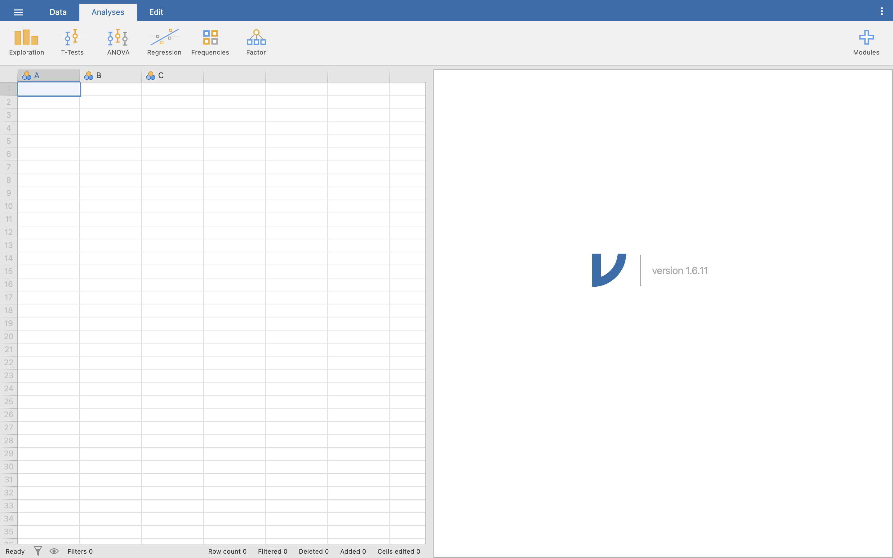

The workspace in Jamovi is divided into a few sections.

- The large grid-like area on the left (that looks like Excel) is the **Spreadsheet**. This is where your data goes!
- The blank area on the right is the **Results Viewer**. This is like a blank sheet of paper where Jamovi prints out the results of any tests you run. You'll see how this works soon.
- At the top is the **Menu**. This has a few options - **Data**, **Analyses**, and **Edit**. We will mostly be using Data and Analyses. When you click any of these options, the **ribbon** area directly underneath changes to show you the things you can do with each option - in the screenshot above, we have **Analyses** selected, so the ribbon is showing us all the various Analyses tests we can run.

The menu also has three stacked white lines in the far left corner - this opens the **File** menu. Click it now, then click **Open**, then **Browse** and navigate to the place you saved all the data files from Weblearn:

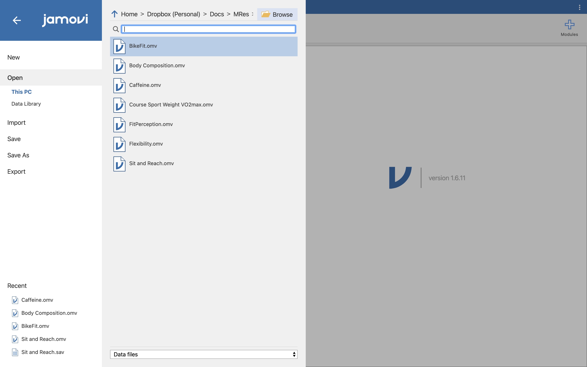

Open the **Body Compsition.omv** file.

You should see data now in the Spreadsheet view. If you want to see more of the data, you can resize the Spreadsheet and Results Viewer by clicking and dragging the thick grey line in the middle of the screen.

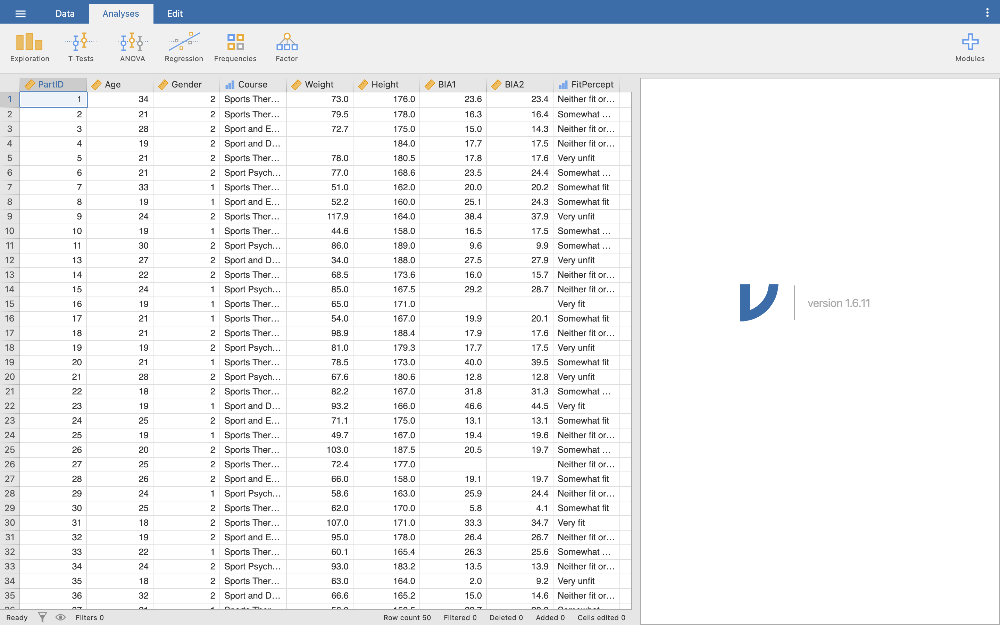

## Cases and variables

In Jamovi, each **column** represents a **variable**, similar to Excel, and each **row** represents a **case**. In Excel, we had to create a dummy Participant ID column as our case identifier. This is the same in Jamovi, which has been named 'PartID' in this file.

::: Questions
[Q1]{}. How many columns of data are there?

[Q2]{}. How many rows of data are there?

[Q3]{}. Why bother with a Participant ID when there is a record number?

[Q4]{}. Why do we need a Participant ID at all? Why not just use the participant's name?

:::

Pay attention to the PartID column - note that some IDs are missing, so the row number does not always match the PartID.

I want you to add one further case to this data sheet, so just type in the following numbers at the bottom of the sheet. You can type directly into each cell (similar to Excel).

- PartID: 53
- Age: 21
- Gender: 2
- Course: [Leave blank]
- Weight: 41.0
- Height: 160.0
- BIA1: 18.8
- BIA2: 18.8
- FitPercept:     [Leave blank]

### Variables setup

So far this sheet is behaving much like Excel in what we can enter. However unlike Excel, Jamovi allows us to enter more information about  what is contained in each of our variables (the spreadsheet columns). This is known as **metadata**. To edit this, click **Data**, then **Setup** (the icon that looks like a gear on top of a mini-spreadsheet). You will get an extra menu open at the top of the Jamovi screen:

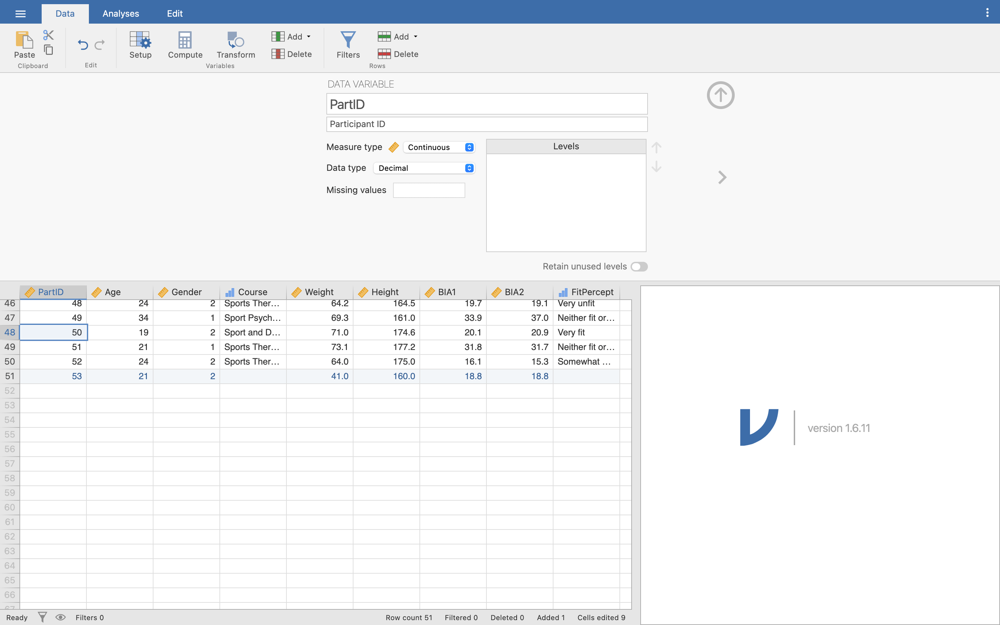

You can see the name of the variable we are editing at the top, in large text. This is the variable **Label**. Click on any cell in another column to change to that variable - see how the text at the top of the variable setup menu changes.

Directly underneath the large Label area is another text box - this is the **Description** area, where you can add a little extra text to make it clearer what is contained in our variable. Click on the PartID column and notice how it says 'Participant ID' now - this is the full name of the variable, rather than the shorter 'PartID' label.

::: Aside

Why do we use separate labels and descriptions? When you're working with a variable, sometimes it can be annoying to type in the full name over and over again - 'PartID' is a lot quicker to type than 'Participant ID'. But, when we want to see our results, we want the full description of the variable to make it easier and clearer to see what our results are referring to.

:::

I now want you to change a couple of variable properties:

- You can see that most of our variables have a Name and Description, but two are missing. For the column **Age** enter the description 'Age (years)' and for the **Gender** column enter the description 'Gender'.

### Variable data types

Underneath the description are some more options. Click on the dropdown menu next to **Measure type**:

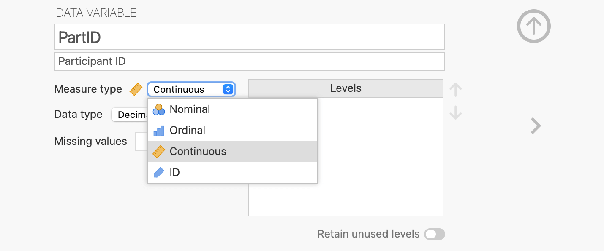

::: Questions
[Q5]{}. How many measure types of data are available in Jamovi? Can you guess how these compare to the NOIR data types covered in lectures?

:::

Jamovi has three main data types:

- Nominal
- Ordinal
- Continuous

Nominal and Ordinal are exactly the same as covered in the lecture on data types. 'Continuous' is just the combination of Interval and Ratio - Jamovi will work out if the data you enter is Interval or Ratio for you behind-the-scenes based on the numbers you actually have in the data.

Jamovi also has one extra data type, called 'ID'. This is just used by Jamovi to identify a Participant ID column - it's exactly the same as a Nominal column, but lets Jamovi know it doesn't need to worry about labelling levels for it, and to just use whatever is typed into the cells. Don't worry about the difference too much - just know that you only need to set your PartID column to 'ID', and can then forget about it!

::: Questions
[Q6]{}. Why would PartID be of the ID or Nominal type even though it appears to be an ordered list of numbers?

:::

Underneath the Measure type options, click the dropdown menu for **Data type**:

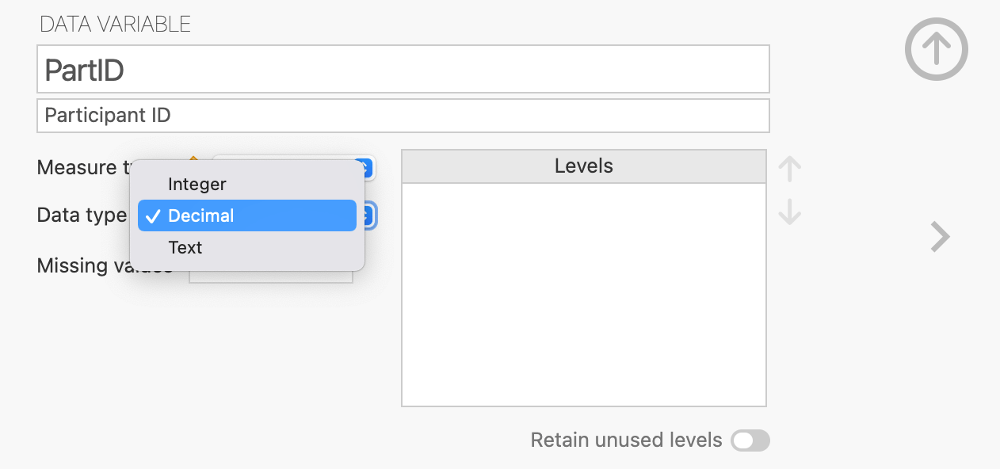

Data types just tell Jamovi what kind of actual data we will be typing in to the cells in the Spreadsheet. These should be fairly obvious:

- Integer: whole numbers without a decimal point (1, 2, 3...)
- Decimal: numbers with a decimal point (1.5, 2.3, 3.0, 4.6...)
- Text: words! (Yes, no, John Smith, football...)

We'll ignore the 'Missing values' section for now.

### Coding variables levels

Finally, on the bottom right of the variable viewer is the **Levels** setup. Here, if we are using categorical data (i.e. Nominal or Ordinal data types), we can set the labels that should appear for each level of that category.

As an example, make sure you're in the variable setup menu, then click on the **Gender** column. Notice how the data is entered as the numbers 1 and 2, rather than in text. Change the **Measure type** to 'Nominal', and you should see the numbers 1 and 2 appear in the Levels box.

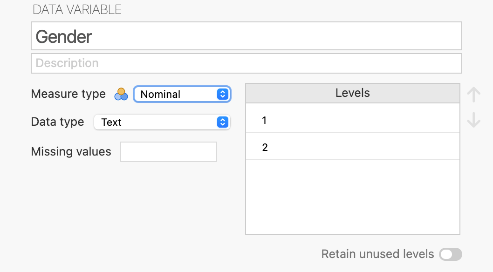

Click on the number 1 in the Levels box to enter the label for this level. Change this from a '1' to the word 'Male'. Click on the number 2 and change it to 'Female'.

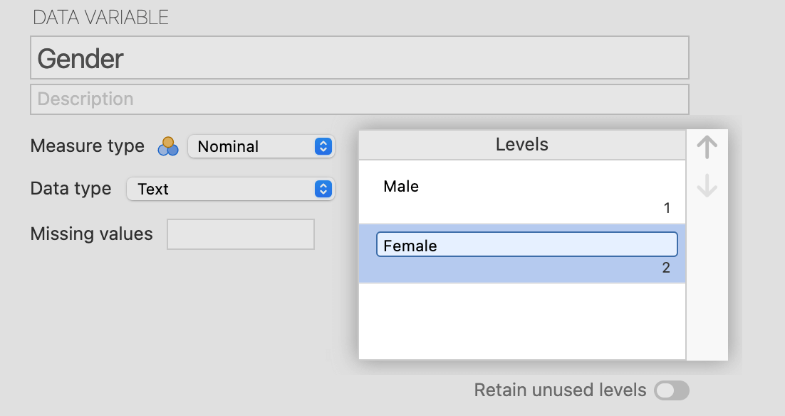

Notice how the numbers 1 and 2 move to the lower right under the text you're typing, so you can still see which label refers to which number. Click anywhere outside the labels box to save these labels. 

Notice now that the cells in the Gender column in the spreadsheet change from '1' and '2' to 'Male' and 'Female'. The underlying data is still the same - we've just labelled it.

::: Aside

Why use numbers and labels for nominal data? Similar to our variables names and labels, it makes it easier to work with the data but still see read our results clearly. For example, if we wanted to choose only the Male participants in this study, we could filter by 'Gender = 1', but our results would still print the full label 'Male'.

:::

Now go through and check all the variables in our data sheet are setup correctly. You should make sure variables match the following:

- PartID: Participant ID, ID measure type, Integer data type
- Age: Age (years), Continuous, Integer
- Gender: Gender, Nominal, Integer, with 2 levels
- Course: Course Name, Nominal, Integer, with 4 levels
- Weight: Weight (kg), Continuous, Decimal
- Height: Height (cm), Continuous, Decimal
- BIA1: BIA Machine 1 Body Fat (%), Continuous, Decimal
- BIA2: BIA Machine 2 Body Fat (%), Continuous, Decimal
- FitPercept: Fitness Perception, Nominal, Integer, with 5 levels

Once you've checked all these variables, click on the circle icon with an Up arrow inside it in the top right of the variable setup menu to hide the menu and return to the main view.

Make sure you save your data regularly - click the three white lines in the top left to access the File menu again, then click **Save**.

::: Aside

**Tip:** Use Ctrl + S on Windows or Cmd + S on Mac as a keyboard shortcut to save your work. Make sure to save regularly to avoid losing anything! All your data, tests, and results are saved in the same .omv file, so you can open it up again later and pick up right where you left off.

:::

### Computing a new variable

We are still missing the BMI variable, so we will create one. You could just create all the data in Excel then copy and paste it into Jamovi, but Jamovi has a **Compute Variable** function which can do the calculation for us.

Click on the **FitPercept** column, then click **Data**, then **Compute** (the icon that looks like a calculator). This will add a new column after the one our cursor is on (which is why we clicked on FitPercept first!) and open the **Computed Variable** menu at the top, similar to the variable setup menu:

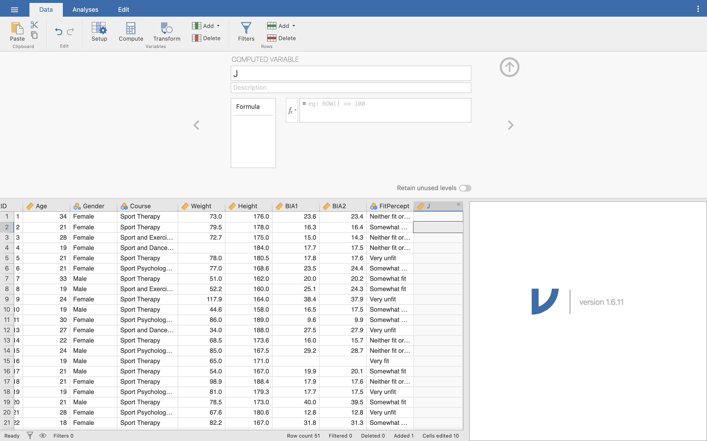

Jamovi automatically gives our variable a letter of the alphabet as a name - 'J' in this case. Change the new variable name to **BMI**, and then enter **Body Mass Index** as the description.

Below the name and description is the **formula box**. Here, we enter a formula to tell Jamovi what to calculate for us - very similar to when we typed functions into Excel, but instead of typing them into one cell and copying and pasting the formula in all the other cells, in Jamovi we just enter the function at the top and it automatically fills it in for the entire column for us.

We can type directly into the formula box, or have Jamovi fill in some parts for us. Click the **fx** button to see all the options we can enter in the formula box:

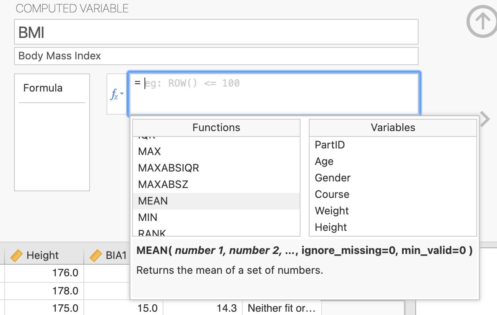

Jamovi tells us what each function does if we click on it once - see here I've clicked on the MEAN function, and Jamovi gives a short description underneath. Next to the functions are our variables. Double click on any of these to insert them into the function box.

Now, type or copy and paste the following into the function box:

```
Weight / ((Height/100) * (Height / 100))
```

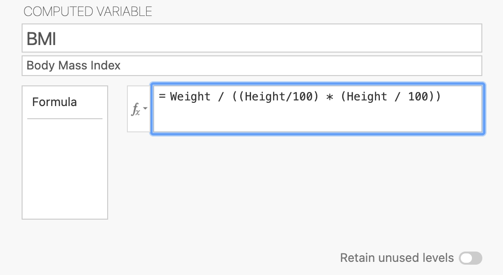

Press enter and you should see the BMI column automatically fill in with our BMI values. Notice that any cases (rows) that are missing any Weight or Height data are also left blank in the new BMI column.

Let's recap: we have looked at the Spreadsheet, which contains our data (cells) arranged as Variables (columns) and Cases (rows). We have looked at the Variable Setup menu to look at the metadata information about our variables and the values they contain. These are the two main components of what we would call data.

The variables and the data are all saved in one Jamovi data file (.omv). Make sure you save your data file as you have made changes to both variables and cases. We will now move on to examine some of our data.

::: Aside

Use the **File** menu from before to save your work - click the three stacked white lines in the corner, then choose **Save** or **Save As**. You can also use the keyboard shortcuts **Ctrl + S** (Windows) or **Cmd + S** (Mac) to save.

:::

\newpage

# Descriptives, plots, and parametric testing

Now that we have our data setup in Jamovi, we can start investigating it with some descriptives, some basic plots, and some parametric testing.

## Descriptive data

In the Excel class we took a lot of time looking at descriptive data. This is information about your data, for instance, the total number of records, the minimum, maximum, range, standard deviation, etc. Jamovi can provide this information a lot quicker than us calculating it ourselves each time. Here we are going to use some the Exploration analyses to help describe our data.

In the **Analyses** menu, click on the **Explore** icon (that looks like a bar graph), then click **Descriptives** in the dropdown menu that appears. A new middle area should open up between our Spreadsheet and Results Viewer:

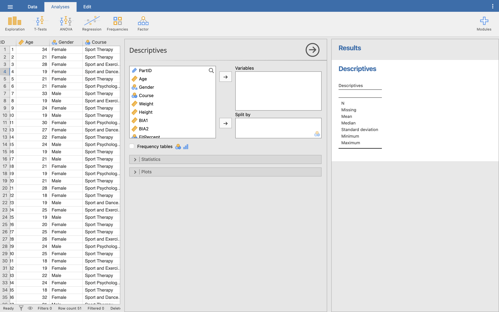

Notice that something has also showed up on our Results Viewer! This is how Jamovi works - when you run an Analyses, the results are printed out onto the viewer on the right. The Descriptives Analyses prints out a table of information by default, but at the moment, we haven't told Jamovi exactly what we want Descriptives of yet, so the table is empty.

Click on the **Weight** variable in the left hand box, and click the arrow to move it into the **Variables** box on the right. Then, click on the **Gender** variable, and use the arrow to move it across to the **Split By** section:

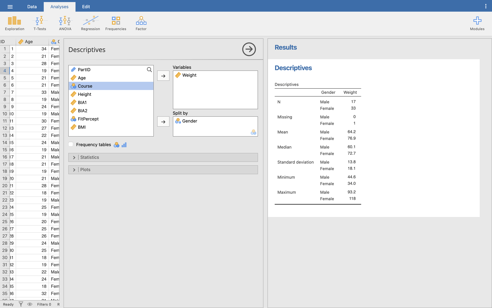

This is a simple way of looking at all the weights of our participants (dependent list) broken down by gender (factor list).

Notice our Results table on the right has now automatically updated to show the Descriptives we have asked for! You should be able to see the mean, median, standard deviation, minimum, and maximum for both Male and Female groups. All of these require separate equations in Excel, so you can see Jamovi is a *lot* quicker to summarise data.

::: Questions
[Q7]{}. In your descriptive data who, on average is heavier, male or female?

[Q8]{}. How many males and females are there? And how big is our total sample size?

:::

Let's look at some more of our data. Previously I mentioned we had two columns, BIA1 and BIA2, where we took the body fat percentage using two ‘identical’ machines. Here we can briefly examine these two fields to compare any differences.

Click on **Weight** in the Variables area and notice the arrow icon changes to point left - click this to put it back into our variables list. Do the same for **Gender**. The table in our Results viewer should go empty again.

Now select **BIA1** and **BIA2** and move them into the Variables box. This will show the same information as before, but now we want a little bit extra. Click on the **Statistics** dropdown menu below our variables selector to see all the various statistics we can ask Jamovi to show us. Click on **Range** to add it to our table in the Results viewer:

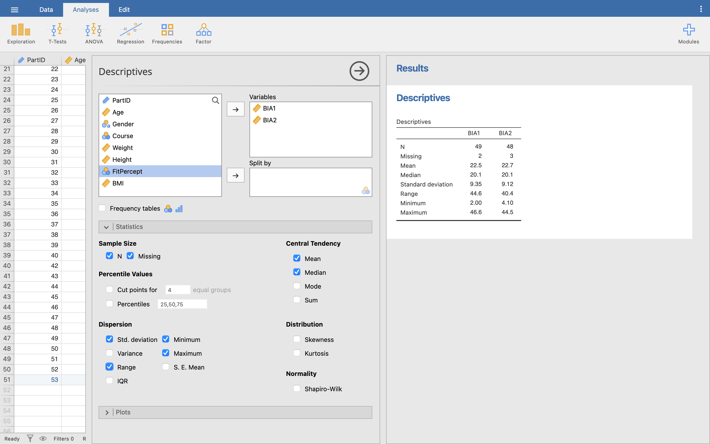

Feel free to click around any other Statistics options you might be interested in - you can add and remove as many as you like at any time in Jamovi, and the Results viewer will auto-update to show what you have changed.

::: Questions
[Q9]{}. From the descriptive data for the two machines, would you say the machines show the ‘same’ results?

:::

### Frequency tables

Let's also see how many students are on each of the four courses offered. Move BIA1 and BIA2 out of the variables selected, then move **Course** into the variables selection box.

Click the **Frequency tables** checkbox underneath our variables selection to add a frequency table to our Results viewer (this will only work for Nominal or Ordinal data types). If you want to make the Results viewer a bit tidier, untick all the other Statistics options, but leave in the **N** and **Missing** options:

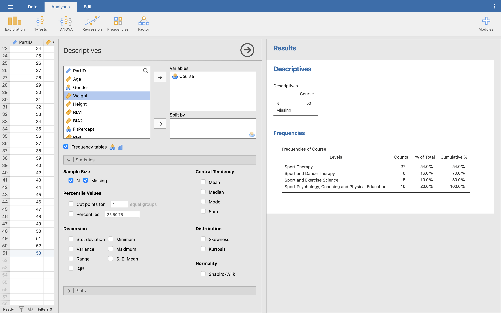

Here you are presented with frequency as a count, as an overall percentage, and as a cumulative percentage. Top table also tells us about the total number of values and how many are missing values - that is, any cases we have that do not have a valid Course ID.

::: Questions
[Q10]{}. How many students actually provided a course id?

[Q11]{}. Which course has the greatest percentage of students?

[Q12]{}. What percentage of students takes Sport and Dance Therapy?

:::

Notice that our counts in the Frequency table add up to the number of valid Course IDs we have in our data. You need to make sure you always check for any missing values in your data - in this case, you might need to go back and find that missing Course ID, or else exclude the case from any further analyses if Course ID is required.

## Basic plots

### Histogram

While we expect you to generate graphs in Excel, and produce tables in MS-Word, you can still generate graphs in Jamovi for a quick view of data before formatting them in Excel. Remember, for any coursework, it is generally best to create your final graphs in Excel so you can completely customise how they look.

We will look at two graphs:

- Histogram
- Box plot

We will continue to use our Body Composition.omv data set. Still in the **Descriptive** menu, clear all the variables from our variable selection, and untick the Frequency table option. Move **Weight** into the variables selection and turn back on the Default descriptive statistics - tick the boxes for N, Missing, Mean, Median, Std. Deviation, Minimum, and Maximum.

Then, you can click the Statistic menu bar again to fold it out of the way, and click on the **Plots** menu bar. Click on **Histogram** to generate a simple histogram in our Results viewer.

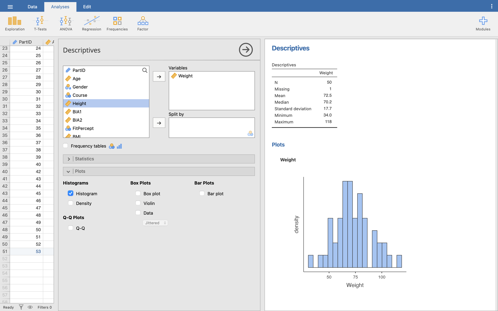

This is a histogram for our entire data set, but we can split this by **Gender** exactly as we did for the Descriptives. Move Gender into the Split By box and see what happens to our histogram:

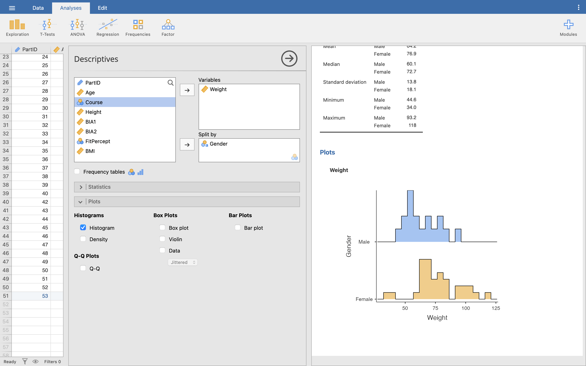

You can split your data using any Nominal or Ordinal variable - try moving other variables in and out of the Split By box to see how the histogram changes.

::: Questions
[Q13]{}. Based on the histograms, which Gender has a greater variability of weight? Why?

:::

### Box plots

Boxplots may also be useful to visually inspect your data, especially if you are looking for outliers. We will use a box plot to check for any outliers in our height data. Clear the selection boxes, then move **Height** into the variables selection, and Split By **Gender** again. Then, click the **Box plot** tick box to show a box plot in the Results viewer:

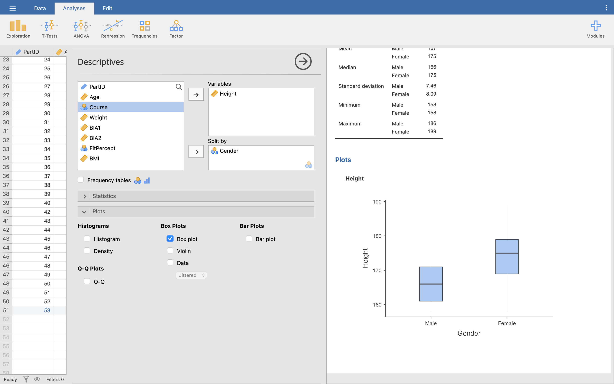

Remember in a boxplot:

- Top whisker = 1.5 x interquartile range
- Top of box = 3rd quartile
- Line in the middle = median
- Bottom of box = 1st quartile
- Bottom whisker = 1.5 x interquartile range

Any outliers are shown with circles beyond the whiskers of the box plot. There are no recognised outliers in our Height data.

::: Questions
[Q14]{}. On the boxplot, what is the approximate value for median male height and median female height?

:::

Feel free to click around now on any other Plot or Statistics options you think look interesting, and try exploring different variables and different ways of splitting the data. Remember, if you want to remove something from the Results viewer, just untick it.

## Parametric testing and assumptions

Before we can decide which test to use we need to look at the ‘quality’ of our data.

There are 4 assumptions we need to look for:

- Level of data
- Independence of data (often called random allocation of data)
- Normal distribution
- Homogeneity of variance

These have all been discussed in the lecture so we will not examine what they mean here, but we do need to look at the third and fourth assumptions and test them in Jamovi.

Remember, if you are comparing multiple variables, then you must check each variable (or segmented variable) against your assumptions.

### Tests of normality (normal distribution)

While we could simply look at a histogram to visually inspect for a normal distribution, there are a number of statistical tests we can also perform. The main statistical test for normality in Jamovi is the **Shapiro-Wilk** (SW) test.

Let us examine the distribution of male and female height data. To compare the two sets of independent data we need to make sure that both male and female data do not deviate significantly from a normal distribution. *(Note: testing repeated measures data requires a slightly different test, but here we will examine normal distribution for independent samples and look at repeated measures later)*

Still in the Descriptives menu, move **Height** into the variables selection, and split the data by **Gender**. Then, under the Statistics menu, click the **Shapiro-Wilk** tick box:

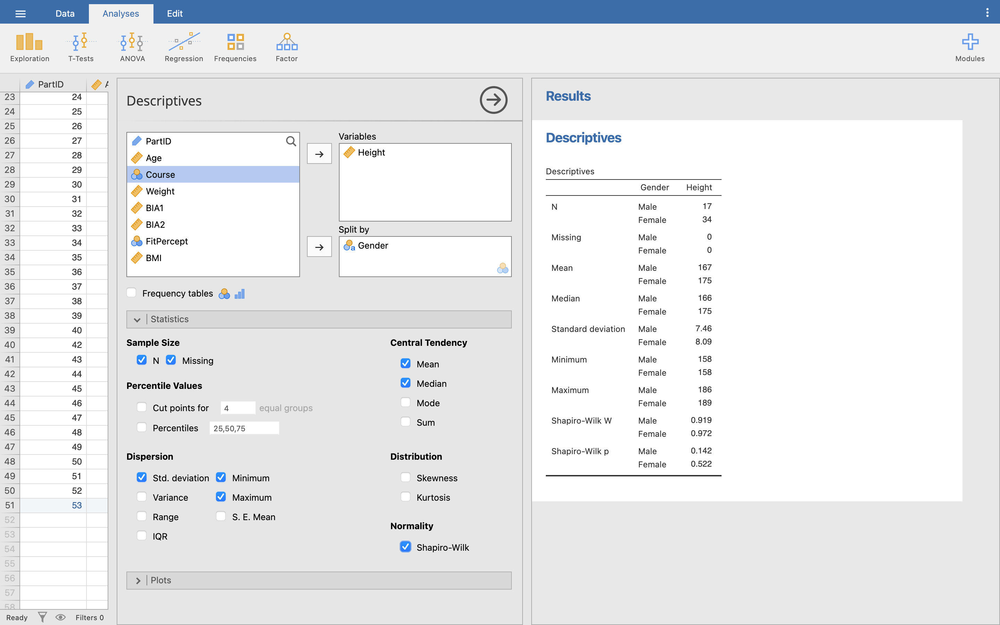

This will add rows for Shapiro-Wilk *W* and Shapiro-Wilk *p* values to our descriptives table in the Results viewer.

Here we are testing whether the distribution of Height (by gender) is normally distributed so we can use parametric tests later. We want to see whether there is a significant deviation from normality, i.e. whether the *p* value result is less than 0.05 for Height for either Male or Female groups. Both groups have *p* > 0.05. This means there is no significant deviation from a normal distribution, so the test of normality has been satisfied.

**Now you try:** Perform a test of normality for **Weight** by **Gender** using the Body Composition.omv data set.

::: Questions
[Q15]{}. What test would you run?

[Q16]{}. What p-value for the test of normality do you get for the Weight data of the Females group? What does this p-value mean?

:::

A simple SW test is ok to start, but you should still perform further checks on your data. The first two we will examine are **Skewness** and **Kurtosis**.

Still in the Descriptives menu, choose the **Height** variable split by **Gender**. Under Statistics, tick **Skewness** and **Kurtosis**.

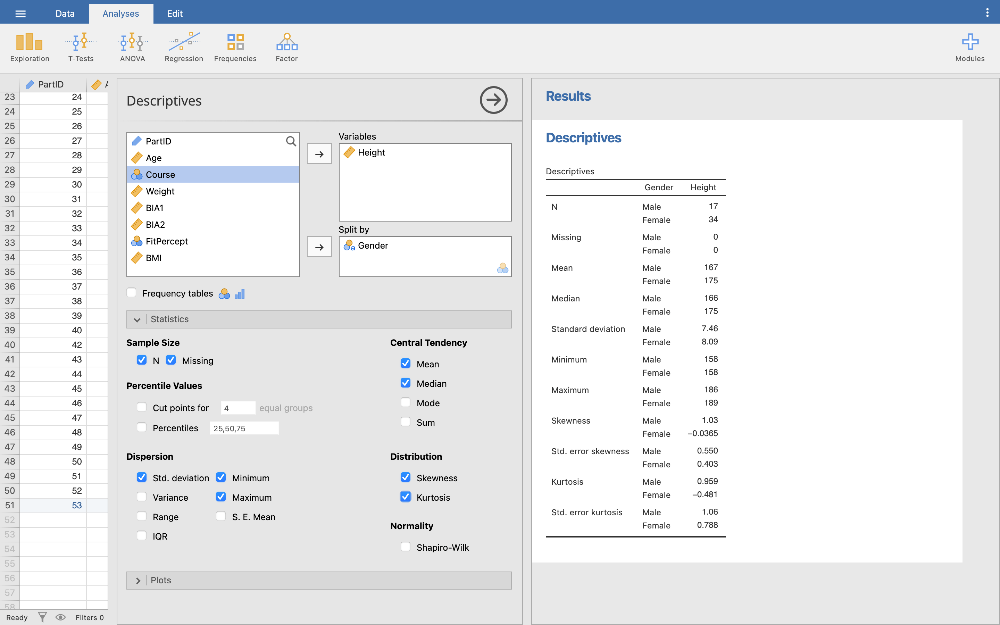

The first way we can examine this data is to look at the *absolute* values for Skewness and Kurtosis.

- Male skewness = 1.028
- Male kurtosis = 0.959
- Female skewness = -0.036
- Female kurtosis = -0.481

::: Questions
[Q17]{}. Based on the raw Skewness and Kurtosis values, describe the shape of your male data distribution.

:::

A rule of thumb suggests that -0.8 to +0.8 is acceptable for skewness and -3 to +3 is acceptable for kurtosis. Note that the skewness for males falls outside the -0.8 to 0.8, but all other values are well within their ranges. Strictly speaking we could suggest that the male height data is not normally distributed, and has a slight positive skew (i.e. a pile up of data on the left hand side).

Turn back on the box plots for this data. You can see the slight positive skew for the male data with a longer positive tail:

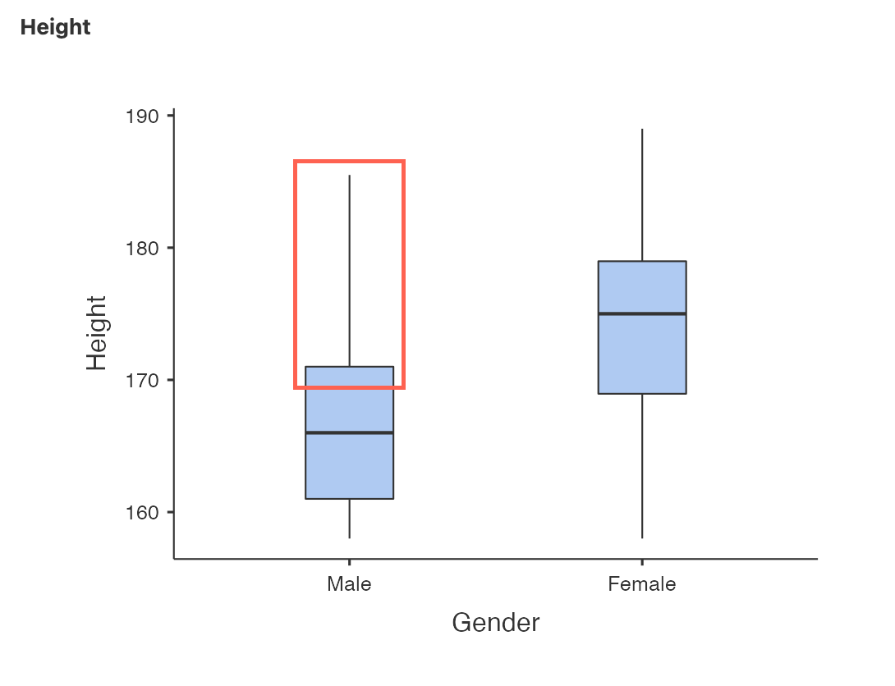

A further way of examining this data is to convert the height skewness and kurtosis to a ‘standardised’ value. We do this by taking the value and dividing it by the **standard error** of its value. You can find the standard error values in the Descriptives table just underneath the Skewness and Kurtosis.

Before we work out our standardised values though, let's change the number of decimal places Jamovi is using to show our Results, so we can be more accurate. In the far top right-hand corner of Jamovi is three white dots - click these to open the **Preferences** panel. Here, change the **Number format** dropdown menu to **3 dp** (3 decimal places). Click anywhere outside the Preferences panel to close it again.

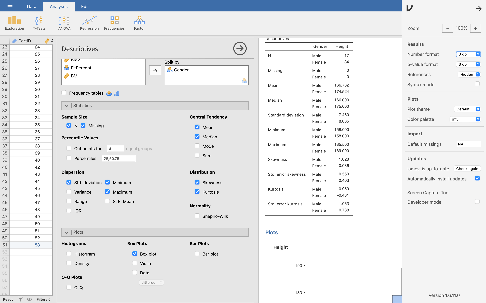

Now we can calculate our standardised skewness and kurtosis values:

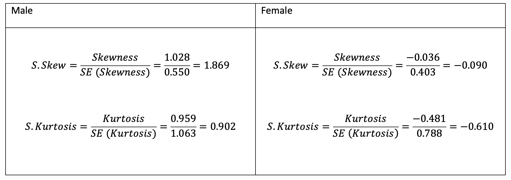

These values can now be compared to the values we would expect to get by chance alone, so a value less than -1.96 or greater than 1.96 would suggest that this distribution is significantly skewed or shows significant kurtosis. Both of our values are within this range so we can be happy that our data satisfies the condition of normality.

::: Aside

**Note:** You cannot use these tests in very large samples as the standard skewness and kurtosis values are likely to be significant even if the skew and kurtosis are only slightly different to normal.

:::

Even though we would like to think that statistics should be clear-cut in giving us answers, you can now see  that it can often requires careful interpretation of your results. Here we have seen two tests that show our data is normally distributed, with one test that shows it is not! This is where your experience of working with numbers is going to be very useful.

::: Aside

**Repeated measures normality:** With independent samples data, or two different groups, you need to check for normality of each separate group. If you have a repeated measures test, e.g. your group performs a test under two different conditions, then rather than testing the normality of each group, you would test for the normality of the *difference* between the two conditions.

:::

### Homogeneity of variance

This is a check to see that the samples we are testing come from populations with a similar variance.

As with the normality test, there is a statistical test and a rule of thumb. Starting with the rule of thumb, we want to make sure that the two sample variances differ by a factor of less than 3.

Imagine we wished to compare male and female height - we therefore need to compare the sample variance of the male height and the female height.

We can view these variances in Jamovi - still with **Height** split by **Gender** selected, tick the **variance** check box. This will display the variances for Male and Female groups in our Descriptives table in the Results viewer.

To test our rule of thumb, take whichever of the two is the larger variance and divide it by the smaller variance. In our case, that would be:

```
65.368 / 55.649 = 1.17
```

1.17 is well within our rule of thumb of 3, so we can *assume* homogeneity of variance. But, let's also test it properly. The statistical test we will use for this is **Levene’s Test of Homogeneity**.

To do this, we actually need to go to a new menu option. Click the right-arrow in the circle at the top right of the Descriptives menu to close it. Then, still in the **Analyses** menu, click the **T-Tests** icon, and choose **Independent Samples T-Test** from the dropdown menu.

This will open the **T-Test** menu. You'll see that it looks very similar to the Descriptives menu - we choose our variables of interest and how we want to split them (here called **Grouping Variable**) at the top, and just tick the things we want Jamovi to show us underneath.

Move **Height** into our variables selection and split by **Gender** again. Don't worry about any of the other options, but just tick the **Homogeneity test** option under **Assumptions**.

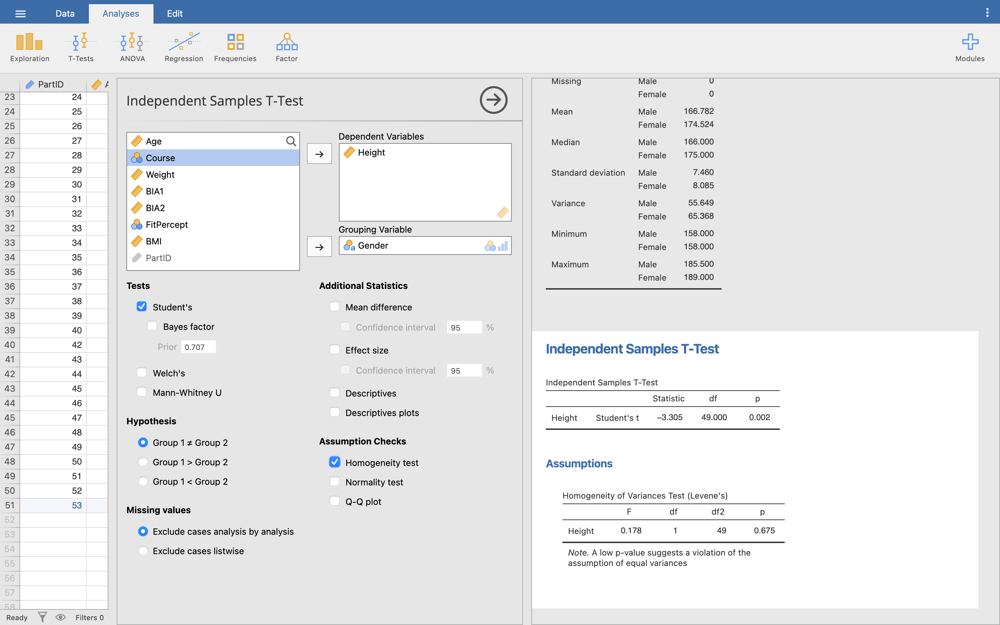

Notice how this gives us a new area in the Results viewer, under the heading **Independent Samples T-Test**. But, our Descriptives table is still displayed above it (you might need to scroll back up). If you click on the descriptives table in the Results, the descriptive menu will open back up in the middle, and you can make any changes. This is how your results are stored and edited in Jamovi - just click them in the viewer to open the menu for that particular result. If you want to remove a result from your viewer entirely, right-click on it's title and select 'Remove' from the pop-up menu.

We won't worry about the T-Test results for now - just look at the table titled **Homogeneity of Variances Test (Levene's)**. Here, we are looking to see if the test result is significant, just as we did for the normality test. The non-significant value of *p* = 0.675 says that the variances are not significantly different to each other and we can continue with our parametric tests.

**Now you try:** Repeat the test of Homogeneity of Variance for Weight by Gender.

::: Questions
[Q18]{}.     What is the Levene statistic and *p* value, and what does this mean?

[Q19]{}.     Would you be happy running a parametric test on this data? And why?

:::

\newpage

# Answers to questions

::: Questions

[A1]{}. In this data file there are 9 columns of data: participant id, age, gender, course, weight, height, BIA1, BIA2 and FitPercept.

[A2]{}. There are 50 rows of data, or 50 ‘cases’. Do not use PartId to show the count of records.

[A3]{}. Even though there is a row number, this does not identify a particular case of data, only the order of the currently displayed rows (or cases). The PartId allows the user to easily identify a particular case.  If you were to sort the data, or filter the data, the row numbers could change, but PartId would remain consistent.

[A4]{}. Firstly the participant id will be unique, but also it allows the data to be anonymised.

[A5]{}. Jamovi has four main data types: Nominal, Ordinal, Continuous, and ID. Nominal and Ordinal are the same as in NOIR, while Continuous is a combination of Interval and Ratio data types. ID is a unique data type to Jamovi, using for participant ID variables only, that is similar to a Nominal data type but without any category levels or labels.

[A6]{}. The field is purely a ‘name’ for each record, you cannot infer that it takes any order, or that one case should come before or after any other.

[A7]{}. The female is, on average, heavier. Female average mass = 76.855 kg, male average mass = 64.153 kg.

[A8]{}. There are 17 males and 33 females in the sample.

[A9]{}. It is difficult to say definitively whether the machines show the ‘same’.  The descriptive information would suggest that ‘on average’ the values are the same, however, individual machines within the sample could display very different results, e.g. machine 1 gives 15% and 25% for two participants, but then machine 2 gives 25% and 15% for the same two. ‘On average’ both machines would show 20%. Just because numbers ‘look’ similar, it does not mean that statistically they are the same.

[A10]{}. 50 students provided a course ID.

[A11]{}. Sport Therapy, with 54%.

[A12]{}. 16% of students take Sport and Dance Therapy.

[A13]{}. From the graph, females appear to be more variable, extending to the left and right of the males in the graph. The standard deviation value is also greater for females (18.08 kg) compared to males (13.84 kg).

[A14]{}. From the boxplot, the median value is the thick black line in the middle of each of the boxes. The approximate value for the median male height is 166 cm and for females, it is 175 cm.

[A15]{}. For a normality test, you would run the Shapiro-Wilk test.

[A16]{}. For females, Shapiro-Wilk *p* = 0.291. This is similar to the male *p*-value. A non-significant value suggests that the sample distribution for female weight is not significantly different to a normal distribution, hence one of the assumptions required for performing parametric testing has been satisfied.

[A17]{}. The positive skewness value (1.028) suggests that the graph has a slightly longer right hand tail, and the positive kurtosis value (0.959) suggests the curve is slightly more thin than a normal distribution (also known as leptokurtic).

[A18]{}. The Levene test statistic, F = 0.642, p = 0.427 (based on the mean). This means that the variances are not significantly different, so we can assume homogeneity of variance.

[A19]{}. Yes, we have satisfied the four conditions, 1. It is high level data, 2. It was randomly allocated/selected, 3. It is normally distributed, and 4. It has homogeneity of variance.

:::