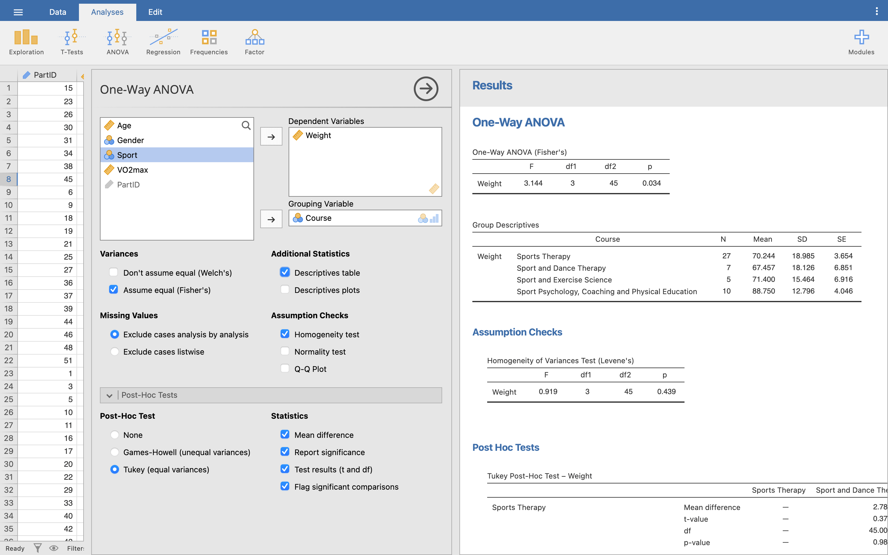
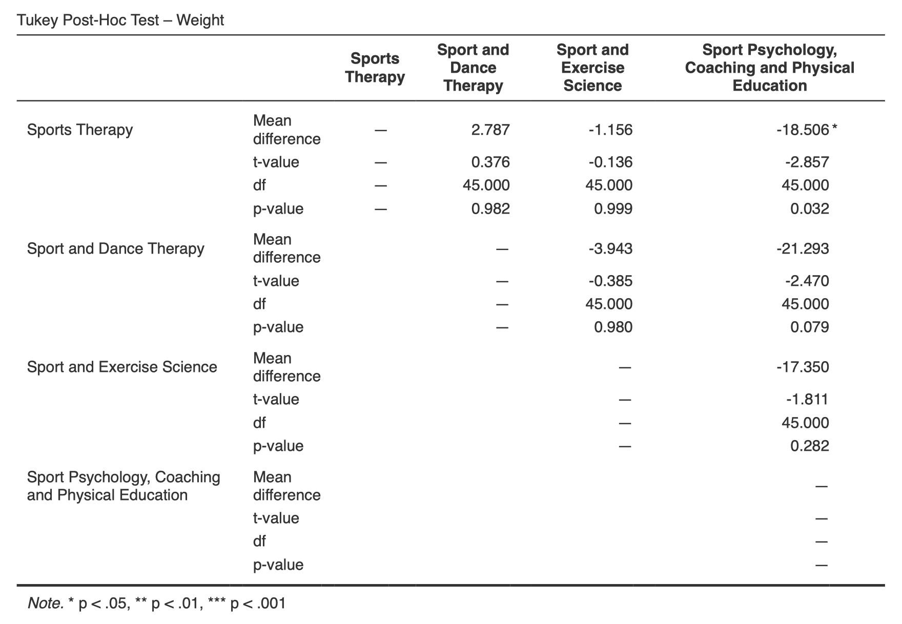
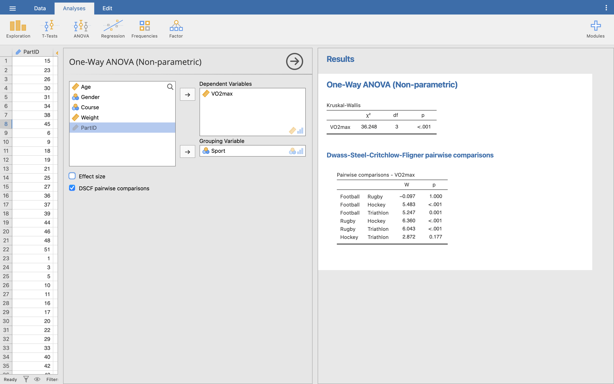
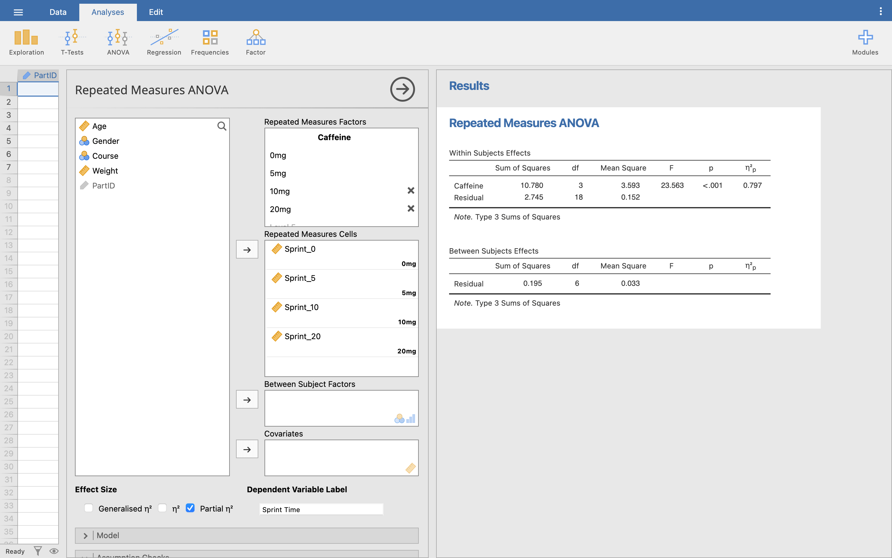
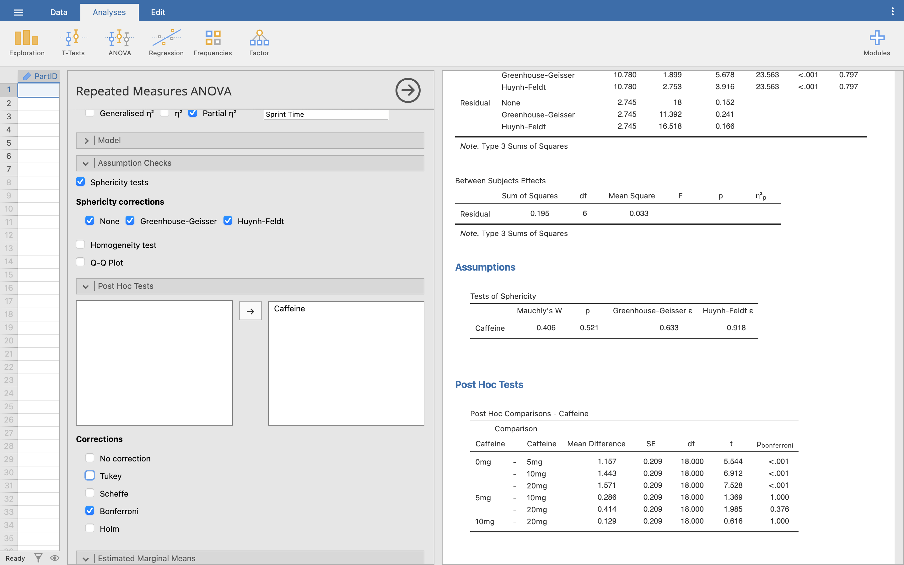
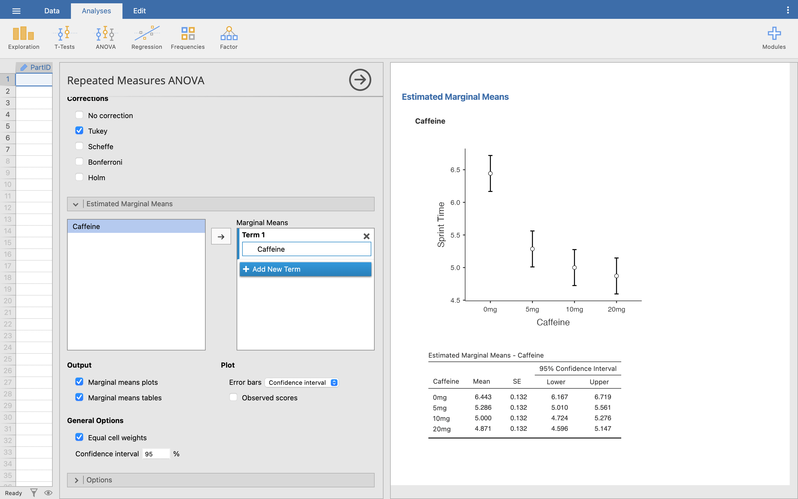
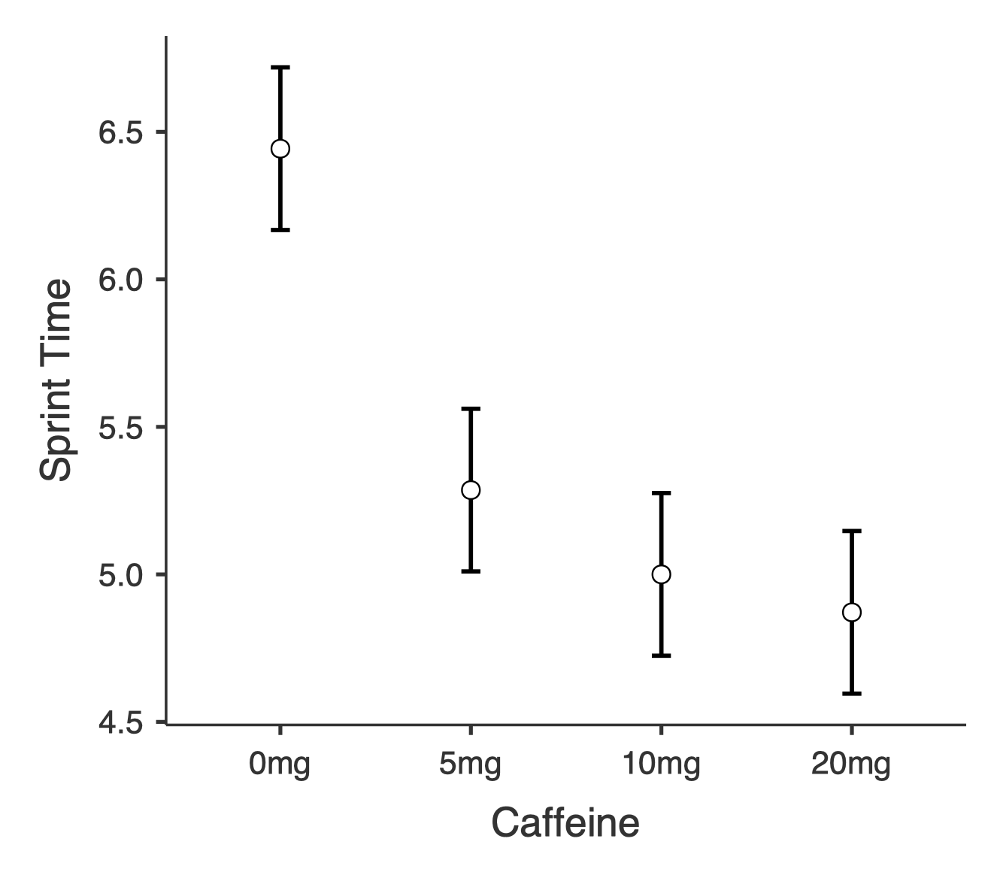
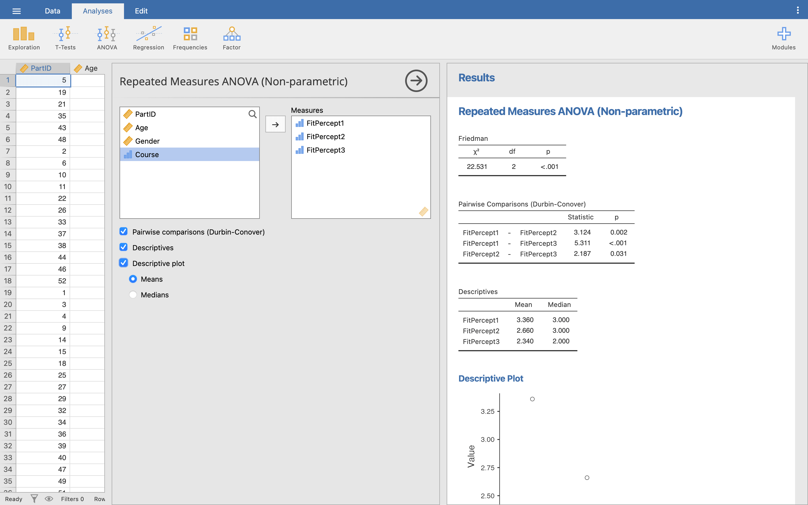

\wordtoc

## ANOVA assumptions

ANOVA has a set of assumptions we need to satisfy to decide if the data is parametric or not, and which test we should run:

- Variances in each condition should be similar
- Observations should be independent
- Dependent variable should be interval or ratio
- Distributions *within* groups are normally distributed
- There is homogeneity of variance between all groups (only for independent ANOVAs)

With one extra assumption specifically for the repeated measures ANOVA instead of homogeneity of variance:

- An assumption of sphericity (homogeneity of variances across multiple pairs in within-subject conditions)

We'll cover these as we go through each ANOVA below.

## Independent groups ANOVAs

### 1-Way ANOVA

We previously looked to see who was heavier, males or females, from our **Body Composition.omv** data. We found that females were significantly heavier than males. However, now we would like to know if the course the student is taking has an impact on their weight (remember this is not cause an effect, just correlation!)

We have a new data file to use here, so open up **Course Sport Weight VO2max.omv**. Our data file has 4 separate groups in the **Course** variable, one per degree course, and we are going to compare **Weight** across the 4 courses.

::: Aside

Before going any further, satisfy yourself that the data in this file is setup appropriately.

:::

Before running the test, we need to check that the data is parametric. We know that the observations are independent, and the dependent variable (**Weight**) is ratio. We just need to confirm that the data within each group is normally distributed and whether or not we satisfy the condition of sphericity.

You should already know how to find some basic information on this data, so run some Descriptives and the Shapiro-Wilk for the 4 different courses.

::: Questions

[Q1]{}. What are the Shapiro-Wilk results for the 4 different courses? What does this mean for the assumption of normality?

[Q2]{}. What is the mean and standard deviation weight for each of the courses?

:::

We'll look at homogeneity of variance next. We can't do this the same way as previous weeks, using the *t*-test menu (try it, and see what error message you get). Instead, click **Analyses**, then **ANOVA**, and **One-Way ANOVA**.

These menus should be familiar to you now, so move **Weight** into the Dependent variables box, and **Course** into the Grouping variable box. Check the **Homogeneity of variances** tick box under assumptions and check the Levene's test results table in the Results viewer.

In the same way as for the *t*-test, we are looking to see whether the Levene Statistic is < 0.05, i.e. is the variance significantly different between each group. Here the *p* value is 0.439, so we can be confident that the variances are not significantly different.

This tells us which parametric ANOVA to run - so under **Variances** now, we can tick **Assume equal**.

::: Aside

Just as with the Student's and Welch's versions of the *t*-test, there are versions of the 1-way ANOVA for if variances are assumed equal or not. In fact, the non-equal ANOVA version is also named after Welch - he was clearly busy!

:::

Turn on **Descriptives** too. Finally, we need to decide what post-hoc tests we will do - that is, the ANOVA will tell us there is a difference between our 4 groups, and the post-hoc tests will tell us exactly where that difference is.

Under **Post-Hoc Tests**, select **Tukey**. This is the Tukey Honest Significant Difference, or Tukey HSD, test. It will compare each group against every other group, but make adjustments behind-the-scenes to minimise the family-wise error rate from running multiple tests at once. Turn on all the options under **Statistics** that Jamovi offers here, too.

::: Aside

You may have heard of the Bonferroni adjustment, or a few other different types of post-hoc adjustments we can use to reduce the family-wise error rate. Jamovi uses Tukey, but they all do the same basic job. If you want more detail on the Tukey HSD, [click here](https://sciencing.com/what-is-the-tukey-hsd-test-12751748.html). Of course, if you wanted, you could still do Bonferroni adjusted post-hoc testing manually in Jamovi using the *t*-test dialogue and manually working our your new significant *p* value (0.05 / no. of tests)!

:::

::: Questions

[Q3]{}. Why do we need to control the family-wise error rate?

:::

The output form the ANOVA is then presented in the Results viewer. Look at the One-Way ANOVA table. This is where we find our test statistic. In the *t*-test, this was the *t* statistic, but in the ANOVA it is the F statistic.

Here, F = 3.144, and the significance is *p* = 0.034. As the *p*-value is < 0.05, we take this as a significant result. This does not tell us where the difference occurs, only that there is an effect somewhere. For this particular test it just tells us that the means of the weights of the students in each of the courses is different, so at least one of the groups has a greater/lesser mean weight than the other groups.

::: Aside

If you are curious, try ticking the box for Welch's test for unequal variances, and see how the ANOVA results compare to Fisher's test.

:::

Let's look at the post-hoc table now. This is presented with all the groups on both the rows and columns of the table - the cell where the two cross is the post-hoc comparison results for that particular row against that particular column. To avoid repetition, Jamovi only shows unique combinations.

As we turned on the option to flag significant comparisons, we first just need to look for any cells marked with an asterisk. Look along the first row - the first cell we can see with an asterisk is for Sports Therapy v. Sport Psychology Coaching and Physical Education (*p* = 0.032). We can see the mean difference between the two groups is 18.5 kg, telling us that Sports Therapy is significantly lighter than Sports Psyc (at the 5% level).

::: Aside

You can see the mean difference here is a negative number (-18.5 kg). If you are ever unsure which way around to read the mean difference between your groups, then go back to the means in your Descriptive data, which will show you which students are heavier.

:::

::: Questions

[Q4]{}. Looking at the post-hoc table, are there any other pairs of courses that are significantly different? 

[Q5]{}. Even though Sport and Dance Therapy appears to be lighter than Sports Therapy it has not shown to be significantly different to Sport Psychology. Why do you think this might be?

:::

Finally, we need to write up the results from our ANOVA:

There was a significant difference in the weight of the students across the London Metropolitan Sports courses *F*(3, 45) = 3.144, *p* = 0.034. Post hoc comparisons using Tukey's HSD indicated that the weight of students taking Sports Therapy are significantly lighter (*M* = 70.24, *SD* = 18.99 kg) than students studying Sport Psychology, Coaching and Physical Education (*M* = 88.75, *SD* = 12.80 kg) *p* = 0.032.

Where previously we included against the *t*-statistic the degrees of freedom, which was calculated as number of cases -1, in the ANOVA we show the number of groups -1, followed by number of cases -1. You can get these values from the ANOVA table.

**Now you try:** As well as making a record of the course each student is on, we have also recorded the sport the student takes part in to see if there is any link between a student’s sport and their weight. Run a One-Way ANOVA with a Tukey HSD post-hoc comparison again in the **Course Sport Weight VO2max.omv** data file.

::: Questions

[Q6]{}. What are the null and experimental hypotheses for this test?

[Q7]{}. What are the 4 parametric tests you need to satisfy to run this test?

[Q8]{}. What are the results of your Shapiro-Wilk test for the 4 sports, and what does this result mean?

[Q9]{}. How many students play Hockey?

[Q10]{}. What is the Mean and Standard deviation weight of the Triathlon Group to 2 dp?

[Q11]{}. What is the result of Levene’s test (based on mean) and what does this result mean?

[Q12]{}. Have you satisfied the 4 parameteric tests?

[Q13]{}. Run the ANOVA. What is your F statistic and *p* value, and what does the *p*-value show?

[Q14]{}. Using the Post-hoc tests, are there any pairs of data that are significantly different to each other? If There are what are their *p*-values.

[Q15]{}. How would you report the result you have found?

:::

### Kruskal-Wallis test

While the ANOVA is fairly robust to violations of its assumptions (e.g. when there is heterogeneity of variance of similar size groups), there is still a fully non-parametric version (the Kruskal-Wallis test) that can be used if we find that our data really fails to meet the assumptions required for a regular 1-way ANOVA, such as normality.

Still using **Course Sport Weight VO2max.omv**, we have the same students, but we want to measure how ‘fit’ they actually are by analysing their **VO2max** values, and seeing if different **Sports** are represented by different VO2max values.

- H~0~: There is no difference in the VO2max values of students who take part in different sport
- H~1~: There is a difference in the VO2max values of students who take part in different sports

Before we run the Kruskal-Wallis test, we need to be sure that the parametric assumptions have been violated, otherwise we might as well use the 1-way ANOVA. Look at those now.

::: Questions

[Q16]{}. What are the 4 assumptions needed for parametric data?

[Q17]{}. Do any of the groups give a significant result against Shapiro-Wilk? If so, what does that mean?

[Q18]{}. What do the results of the Test of Homogeneity of Variances tell you?

:::

::: Aside

For those interested, if you were aiming for maximum completeness in your lab reports, you would report the above violations in order to justify the use of the Kruskall-Wallis test. In fact for all lab reports (and especially when you move into the 3^rd^ year) you need to be able to justify the statistical tests you perform. In this case, you could say that:

"Preliminary results using a Shapiro-Wilk test showed that the data for the Football Group was significantly different from normal (df(8) = 0.334, *p* = 0.016), as were the Triathlon group (df(12) = 0.255, *p* = 0.006). Also, the assumption of homogeneity of variance has been violated, F(3, 45) = 2.821, *p* = 0.049). As such the data are not normally distributed and with heterogenous variances, and a Kruskall-Wallis test was performed to compare the groups."

This is a bit of a mouthful, but really does show your reader (and lecturer) that you know how to perform a statistical analysis.

:::

Let's run the Kruskal-Wallis. Click **Analyses**, **ANOVA**, then **One-Way ANOVA (Kruskal-Wallis)**. As before, move **VO2max** into Dependent variables, and **Sport** into Grouping variable. We won't worry about effect size, but tick **DSCF pairwise comparisons**.

::: Questions

[Q19]{}. Based on your previous knowledge, what does the Kruskal-Wallis table in the Results viewer now tell you?

:::

The test statistic (*χ^2^*, pronounced chi-squared) here is 36.248, and the significance is *p* < .001. So we can clearly see that there is a significant difference between the type of sports taken part in and the VO2max of the participants, but as with the 1-way ANOVA it does not tell us which group(s) is/are significantly different to the others. For that, we should look at the pairwise comparisons table below.

::: Aside

Don't worry about exactly what the Dwass-Steel-Critchlow-Fligner method for pairwise comparisons is. Just know we interpret it like the Tukey HSD we did above. If we wanted to do this manually, we could run a Mann-Whitney U test for each comparison, with a Bonferroni adjusted *p* value.

:::

This is laid out slightly differently than the Tukey HSD table from before, but does a similar thing - shows us the comparison of each group with every other group. Look at the *p* column for our significance values. We don't get the mean differences in this table, so go back to our Descriptives to get a sense of which group has the greater VO2max in each comparison.

Lots of the groups are significantly different from each other! Only Football v. Rugby, and Hockey v. Triathlon are not significantly different.

Let's write up our results:

There was a significant difference between the sport the students take part in and their VO2max results, *χ^2^*(3) = 36.248, *p* < 0.001. Follow up testing was performed with Dwass-Steel-Critchlow-Fligner pairwise comparisons. It appears that VO2max is significantly different between Football and Hockey (*W* = 5.483, *p* < 0.001), Football and Triathlon (*W* = 5.247, *p* = 0.001), Rugby and Hockey (*W* = 6.360, *p* < 0.001), and Rugby and Triathlon (*W* = 6.043, *p* < 0.001).

## Repeated measure groups

### Repeated measures 1-way ANOVA

This is the partner measure of the 1 way independent measures ANOVA. Where the 1-way independent ANOVA examined several groups for one particular measure or result, this time we will be looking at 1 group for several (repeated) results. For instance, we might want to examine 1 group under several conditions (e.g. 5mg caffeine, 10mg caffeine and then 20 mg caffeine intake) and the effect on sprint performance (50m sprint time). For this test, I took all the Sport and Dance Therapists, and performed a double blind randomised placebo-controlled trial.

::: Aside

Out of interest, you really need to know how to handle your decimal places if you are going to perform experiments using caffeine: [Northumbria University 'life-threatening' caffeine test fine](https://www.bbc.co.uk/news/uk-england-tyne-38744307)

:::

::: Questions

[Q20]{}. What does double blind mean?

[Q21]{}. Why do I need a placebo trial?

:::

Open up the **Caffeine.omv** data file. We'll assume our data is parametric (feel free to test it yourself if you're curious).

Click **Analyses**, then **ANOVA**, and **Repeated Measures ANOVA**.

This is probably the most different of all the menu options we've seen so far. Here, we need to tell Jamovi the names of all our levels of independent variable (Caffeine intake) first - so in the top box marked **Repeated Measures Factors**, give our factor a name (Caffeine) and enter 4 labels - 0mg, 5mg, 10mg, 20mg.

Then, drag each variable - **Sprint_0**, **Sprint_5**, etc. - into the **Repeated Measures Cells** box (where it says 'drag variable here') in the **same order** that we just labelled the factors above. Ignore the 'Between Subject Factors' and 'Covariates' boxes.

Underneath, tick **Partial η^2^** and enter **Sprint Time** as the **Dependent Variable Label**.

Then, under **Assumptions**, tick **Sphericity tests** and make sure all three **Sphericity corrections** are also ticked. Under **Post Hoc Tests**, move **Caffeine** over into the testing box. Let's change things up for our post-hoc method and tick **Bonferroni** rather than using Tukey again.

::: Aside

Notice that we could still pick Tukey here if we wanted - Jamovi is built on the [R programming language](https://www.r-project.org/) for statistical analysis, so depending on what R function is used under-the-hood, different options become available to us. Jamovi is still being developed so eventually all the tests might come to all the analyses, but for now, we still have everything we need. Your exact choice of post-hoc test is ultimately up to you, as long as you can justify why you chose it! If you're curious, turn **both** Bonferroni and Tukey on, and compare their results in the table.

:::

Finally, under **Estimate marginal means**, move **Caffine** into the **Term 1** box and tick **Marginal means plots** and **Marginal means tables**.

This all produces a lot of information in the Results viewer, so we will work through just the important bits.

Under the Estimated Marginal Means - Caffeine table, we can find some basic descriptives for our ANOVA. These are both useful to check that your variables are entered in the right order. It already looks like the greater the amount of caffeine ingested, the quicker the 50m sprint performance, but we are unable to say yet whether this is statistically significant.

Next, find the Test of Sphericity table. As with other pre-test tests, we want this test to be non-significant, to show that Sphericity has not been violated. Our *p* here is greater than 0.05, so we can assume that sphericity has not been violated, and can assume that the variances of the differences between levels are equal.

Next is the main ANOVA output. Find the Within Subjects effect table (ignore the between subjects table completely).

::: Aside

Within subjects is another way of saying 'repeated measures', because whatever effect we are investigating is occurring within each subject/participant we are looking at. 'Between subjects' is another way of saying independent measures. These only matter when you get to 2-way ANOVA later, where you can mix both within and between subject factors in the same ANOVA (which can get complicated fast!)

:::

In the Within Subjects table, all we are concerned with in this test is the first row of data, the Caffeine records, and we read the line with ‘None’ under the Sphericity Correction column.

::: Aside

Had sphericity been violated, then we would look at the Greenhouse-Geisser or Huynh-Feldt rows for our results instead.

:::

*F* (the repeated measures test statistic) is 23.563, and *p* < .001, showing that there is a significant difference between the groups (this confirms what we thought we saw in the means). But still, we do not know yet exactly which level of caffeine is significantly different from the others.

For that, let's jump down to the Post-Hoc Comparisons table. This reads across the rows (not rows x columns like the independent ANOVA post-hocs).

We want to compare based on the control group (0 mg), so we can see that the time taken for the 50m sprint is significantly less when ingesting either 5 mg (*p* < 0.001), 10 mg  (*p* < 0.001) or 20 mg (*p* < 0.001) of caffeine compared to no caffeine

What is interesting though is that while 10 mg and 20 mg are significantly better than no caffeine at all, they are not significantly better than just 5 mg (5 mg compared to 10 mg, *p* = 1.000 and 5 mg compared to 20 mg, *p* = 0.376). 10 and 20 mg are also not significantly different to each other (*p* = 1.0).

If this is a little complex to get your head around, then if we bring in the graph of this from the estimated marginal means section, it will hopefully become clearer:

From the graph it is clear to see that the 3 caffeine groups (5 mg, 10 mg, and 20 mg) are much lower than the no caffeine group (0 mg), but the three caffeine groups are very close to each other.

We can now report what we have found:

The results show that the sprint performance was significantly affected by the ingestion of caffeine *F*(3, 18) = 25.563, *p* < 0.001. Post hoc tests using the Bonferroni correction revealed that 5 mg of caffeine significantly improved performance times (*p* < 0.001), but any increase above that was not significantly different to the 5 mg ingestion (5-10 mg: *p* = 1.00, 5-20 mg: *p* = 0.376, 10-20mg: *p* = 1.00).

### Friedman's ANOVA

Friedman’s ANOVA is the non-parametric version of the Repeated Measures ANOVA.

Similar to the Kruskal-Wallis 1-way ANOVA (for independent groups), the Friedman’s test is used to detect differences in treatments within one group across multiple test attempts. For instance, for the Kruskal-Wallis we could look at the perceived fitness across each of the courses, but how could we analyse the perceived fitness of the overall cohort at different time points? This is where Friedman’s ANOVA can be used.

Similarly while the Mann-Whitney U was used to compare two groups based on their perceived fitness, the Friedman will allow for multiple groups.

In this example we will use the PerceivedFitness measure once more, but this time from a new data file with some extra data. Load the **FitPerception.omv** data file.

In this we have asked our group for their perceived fitness level (a nominal data type), but this time they were asked at the start of their first, second, and final year of their degree course, presented as **FitPercept1**, **FitPercept2**, and **FitPercept3** respectively. We now want to know if their perception of their fitness level changed over the period of their degree.

Click **Analyses**, **ANOVA**, and **Repeated Measures ANOVA (Friedman)**.

This menu is similar to the parametric repeated measures test from from, but a bit simpler due to being non-parametric. Here, all we need to do is move all 3 variables into the **Measures** box, and tick all the options underneath.

We can see from the Descriptives table and plot that there appears to be a drop in perceived fitness level each year (perhaps as sports science knowledge increases?).

From the Friedman results table, we see the *χ^2^* (chi-square) test statistic (22.531), the test statistic’s degrees of freedom (3 groups, so 3-1 = 2 degrees of freedom), and the significance, *p* < 0.001. This shows that the level of study does affect the perception of fitness.

Finally, we can look at the pairwise comparisons results to see how each year differs from each other.

::: Aside

Another test, another post-hoc - Durbin-Conover is just another method for performing post-hoc that is appropriate for the Friedman ANOVA. This time the test statistic is *T*. We could also adjust the *p* value we'd accept using the Bonferroni method and run a Wilcoxon signed rank test on each pair manually.

:::

Here, every comparison differs significantly from each other, indicating that fitness perception has decreased a significant amount each year of the degree course.

Let's write up our findings:

The perceived fitness level of the students changed significantly over the 3 years of study, (*χ^2^* = 22.531, *p* < .005). Durbin-Conover tests were used to follow up on this finding. It appeared that perceived fitness level significantly dropped between year 1 and year 2 of study (*T* = 3.124, *p* = 0.002),between year 2 and year 3 of study (*T* = 2.187, *p* = 0.031), and between year 1 and year 3 of study (*T* = 5.311, *p* < 0.001).

\newpage

# Answers to questions

::: Questions

[A1]{}. *p* for each course is: Sports Therapy = 0.629, Sport and Dance Therapy = 0.642, Sport and Exercise Science = 0.701, Sport Psychology, Coaching and Physical Exercise = 0.875. None of the results are significant, i.e. none of the distributions are significantly different to a normal distribution, so we can assume that the data is normally distributed.

[A2]{}. Sports Therapy = 70.24 ± 18.99 kg, Sport and Dance Therapy = 67.46 ± 18.13 kg, Sport and Exercise Science = 71.40 ± 15.46 kg, Sport Psychology, Coaching and Physical Exercise = 88.75 ± 12.80 kg.

[A3]{}. Family-wise error = Type 1 error, where we are rejecting the null hypothesis when we should not, i.e. we have found a significant result purely by random chance when there is not actually a real difference. The more tests we run, the more this chance of finding a significant result randomly increases, so we need to control for it.

[A4]{}. No, all other comparisons result in a non-significant *p* value.

[A5]{}. Some extra effort to examine this, but this is what would push you into the ‘way above expectations’ in your dissertation. Firstly lets’ look at the group means in the Descriptives table. It is clear that SDT < ST and SDT < SP, however, the group size is really important here. SDT has a much smaller group size, so when considering the population mean (rather than the sample mean) we are much less confident about what the population mean is. If you click the **Descriptives plots** option in the ANOVA menu, you can see that the 95% CI for the means of each group overlap massively, showing we are less confident about our mean weight. Compare the 95% CI’s ST for the whole 95% is less than the 95% CI for SP, whereas the 95% CI for SDT overlaps the SP CI. Clearly then the two sets of data are not *completely* different, there is a chance that the mean of the two groups is the same (at the 5% level). This is one of the main reasons you should not just compare means!

[A6]{}. H~0~: There is no difference between the weight of the student based on the sport they take part in. H~1~: There is a difference in the weight of the students based on the sport they take part in.

[A7]{}. Normality, homogeneity of variance, high level data, independence of samples.

[A8]{}. Shapiro Wilk tells us whether the data is significantly different to normal distribution, as this is independent samples, we run it on each group: Football = 0.093, Rugby = 0.926, Hockey = 0.803, Triathlon = 0.999. None are < 0.05, so none are significantly different to normal, we accept the test of normality for parametric data.

[A9]{}. 15 students play hockey

[A10]{}. 65.02 ± 17.17 kg

[A11]{}. Levene’s test statistic = 0.015, *p* = 0.997, i.e. the variances are not significantly different.

[A12]{}. Yes! High level data (weight = ratio), all data samples are independent, each of the 4 groups are normally distributed, and finally equality of variance has been shown.

[A13]{}. F = 3.148, *p* = 0.034. *p* < 0.05 shows that at least one of the means of the groups is significantly different to one of the others.

[A14]{}. Only one significant pairing. Triathlon vs Football, where triathlon is, on average, 23.6 kg lighter than the footballers, *p* = 0.025.

[A15]{}. There was a significant difference in the weights of the students based on the sport they took part in, F(3, 45) = 3.148, *p* = 0.034. Post-hoc comparisons using the Tukey HSD test indicated that students who took part in football were significantly heavier (M = 88.58 kg, SD = 17.50 kg) than those who took part in triathlon (M = 65.01 kg, SD = 17.17 kg) *p* = 0.025, with no further significant pairwise comparisons.

[A16]{}. High level data, independent measures, normality of *each group*, and homogeneity of variance.

[A17]{}. Yes, and Triathlon = 0.006, and Football = 0.016, this means that 2 of the groups fail the condition of normality.

[A18]{}. Looking at the Levene's test results, *p* = 0.049. This tells us that the variances are not equal between the groups. If the data were normally distributed, we could make use of the Welch correction, but as we also have violation of the assumption of normality we need to find another test that doesn’t rely on these assumptions.

[A19]{}. *p* < 0.001, so it says that there is very strong evidence against the null hypothesis that the mean VO2max of the 4 groups of students (based on participation sport) is equal, i.e. there is strong evidence that the V̇O2max of student depends on the sport they take part in.

[A20]{}. This means that neither I nor the participants knew whether they were taking caffeine or the placebo, another researcher kept the list secret. See: [Randomized double blind placebo control studies, the “Gold Standard” in intervention based studies](https://www.ncbi.nlm.nih.gov/pmc/articles/PMC3505292)

[A21]{}. The placebo is there to see if any improvement in outcome is due to the drug or simply due to taking part in the study.

:::
