\wordtoc

\newpage

# Factorial ANOVA

Factorial ANOVA involves one dependent variables, but **multiple** between-subject independent variables. Fortunately running a factorial ANOVA in Jamovi is not much more complicated than a One-Way ANOVA, but we need to be aware of some differences in reading the results.

## Assumptions

Factorial ANOVA has the same assumptions as a One-Way ANOVA for between-subjects / independent samples, so run the same checks as the previous worksheet for normality and some basic descriptives to check for outliers. Most of the assumptions we can also check from the ANOVA menu once we begin testing.

## Running a factorial ANOVA in Jamovi

Open the data file **Course Sport Weight VO2max Repeated.omv**. Under the **Analyses** tab, select **ANOVA** and then **ANOVA** again.

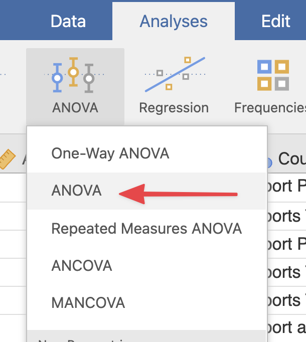

The menu that opens should be fairly familiar to you by now. Let's try testing to see if Weight is different between male and female participants, and across the Courses offered. Drag **Weight** into the Dependent Variable box, and **Gender** and **Course** into the Fixed Factors box.

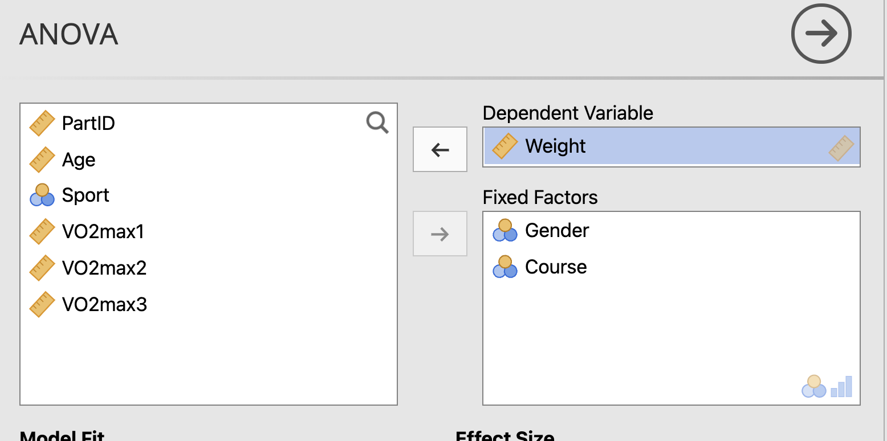

Let's also check our assumptions - under the **Assumption Checks** dropdown menu further down the ANOVA menu page, tick the options for both **Homogeneity test** and **Normality test**.

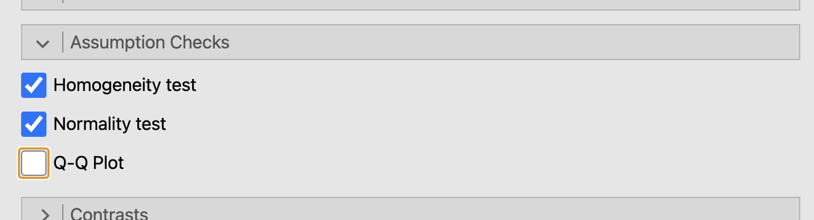

Take a quick look at the results of our assumption checks in the results viewer:

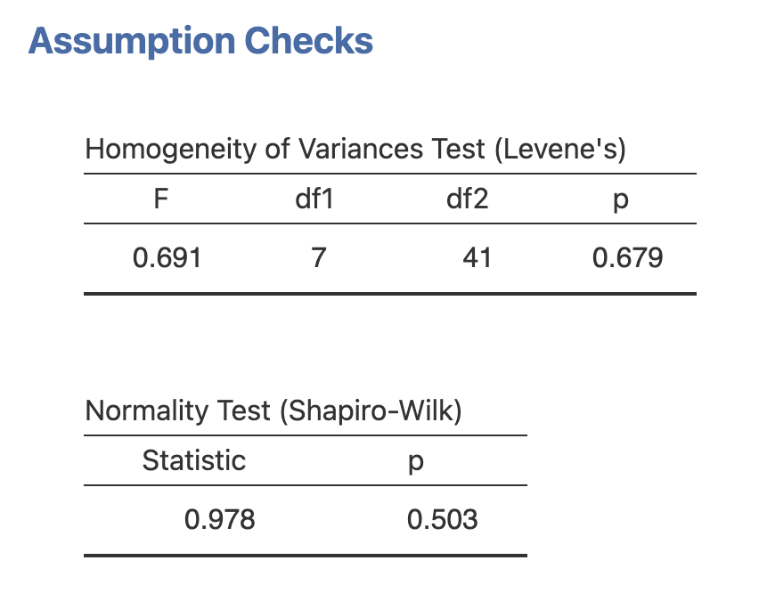

Neither of these tests result in a signficant *p* value (*p* < 0.05) so we can consider the assumptions met.

Now take a look at the main ANOVA results that appear in the results viewer.

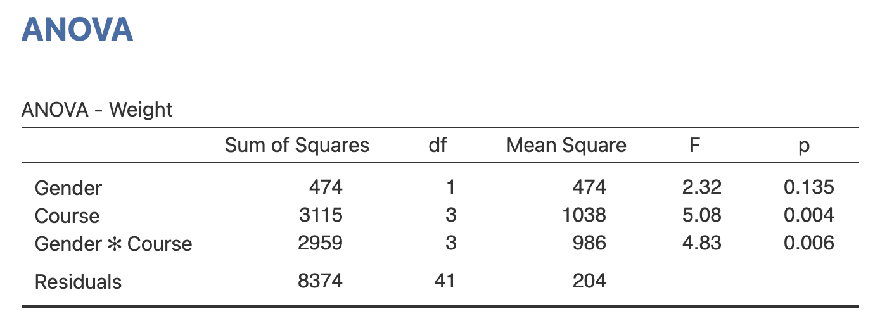

We can see the *F* and *p* results for both the *main effects* of Gender and Course, which can be read in a similar way to the one-way ANOVA results previously. We also have a row for the *interaction effect* between Gender and Course in 'Gender * Course'.

Looking at the *p* value results, we would say that there is a significant interaction effect of Gender and Course, as well as a significant main effect of course, on the Weight results.

::: Aside

We can go back into the ANOVA menu and turn on effect sizes by ticking the 'partial η^2^' option. This will show up in the ANOVA results table and tell us the effect size for each main effect, and the interaction effect.

:::

## Factorial ANOVA post-hoc tests

Now we have a significant ANOVA results for the interaction effect and main effect of course, let's investigate those further with some post-hoc tests.

Under the **Post Hoc Tests** dropdown menu further down the ANOVA menu, move both our significant results - **Gender * Course**, and **Course** - into the right-hand box. Pick your post-hoc correction - we'll use Tukey for this example - and tick the option for Cohen's D under Effect Size.

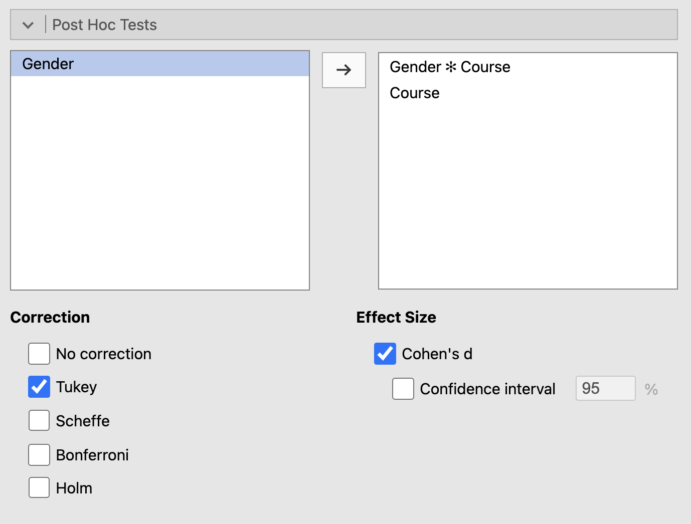

This will probably produce quite a lot of output in the results viewier! To start with, let's just look at the results for the main effect of Course:

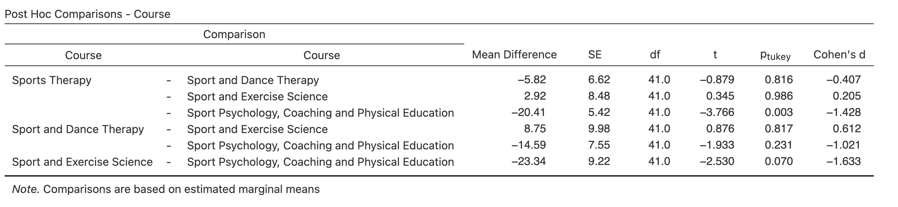

This table compares every group to every other group. We can see from our *p* value results that the Sports Psychology group is significantly different in Weight to the Sports Therapy and Sport Exercise Science groups, but no other groups significantly differ.

Now let's look at the results from the interaction effect of Gender * Course. This table is too large to easily show here, but you can read it in the same way - it is comparing every group to every other group. So it will compare the Male Sports Therapy group to the Female Sports Therapy group, then to the Male Sports Psychology group, the Female Sports Psychology group, the Male Dance Therapy group... etc, etc.

This produces a lot of results, but ultimately we read the *p* values the same way - so we can see a significant difference between the Male and Female Sports Therapy groups, for example (*p* = 0.003).

::: Warning

If you have a lot of results like this, you may want to consider some planned comparisons with Contrasts - we won't go over them here, but you can investigate them further in Jamovi in the [Learn Stats with Jamovi](https://www.learnstatswithjamovi.com/) book, chapter 14.7.

:::

## Factorial ANOVA plots

When we have a lot of results like this, it can be easier to visualise what's going on with an *interaction plot*. To create one, head to the **Estimated Marginal Means** dropdown menu in the ANOVA menu. Move both **Gender** and **Course** into the box titled **Term 1** on the right hand side. Tick the **Marginal Means Plots** option underneath.

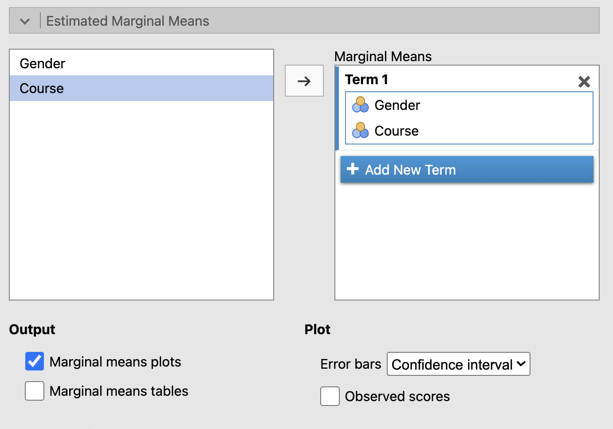

A new plot should display in the results viewer.

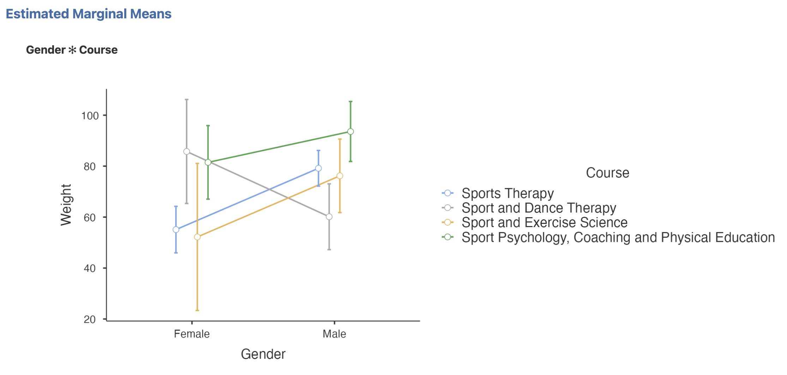

This is an interaction plot. The two groups on the *x* axis represent the Male and Female groups, while the colours of the points and lines indicate the Course groups. Notice where the lines cross each other - this indicates the interaction effect between Course and Gender. It seems most groups get heavier going from Female to Male, except for the Sport and Dance Therapy group, which gets lighter.

Let's look at a plot for the main effect of Course as well. Back in the Estimated Marginal Means menu, click the button for **Add New Term** and move just Course into the new term box.

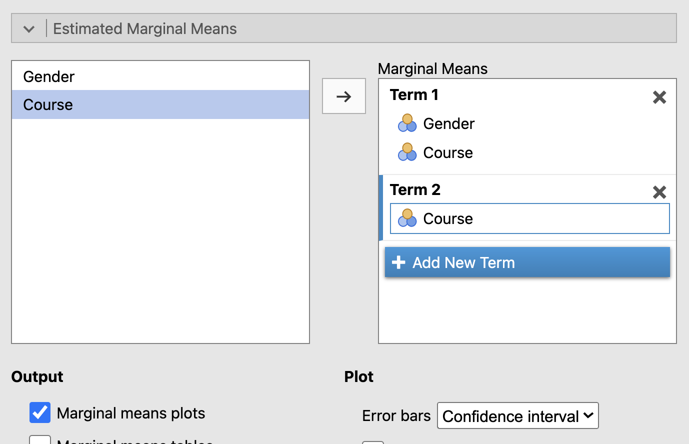

A new plot should display in the results viewer. As there is just the one main effect shown, there won't be any lines to cross, but we can still see from the confidence intervals shown in the error bars how the groups overlap or don't overlap. It seems most of the groups have overlapping confidence intervals, indicating no significant difference, except for Sports Therapy and Sports Psychology - which reflects our post-hoc testing results from before.

Untangling the web of influence of interaction and main effects can be a lot of work, but with some simple visualisations like these you can figure out what is making the difference in your results!

# Mixed design ANOVA

Mixed design ANOVA is similar to Factorial ANOVA, except now one of the independent variables is between-subjects and one is within-subjects. We treat mixed design ANOVA in a similar way to repeated-measures one-way ANOVA, but with the added wrinkle of an interaction effect.

## Assumptions

Mixed design ANOVA includes basically ALL of the assumptions for the other ANOVA types we've already looked at, as it includes both between and within subject groups. This means we need to look at normality for all the groups, homogeneity of variance for the between-subjects, and sphericity for the within-subjects. Phew!

## Running mixed design ANOVA in Jamovi

Still with the data file **Course Sport Weight VO2max Repeated.omv**, in the **Analyses** tab, select **ANOVA** and then **Repeated Measures ANOVA**.

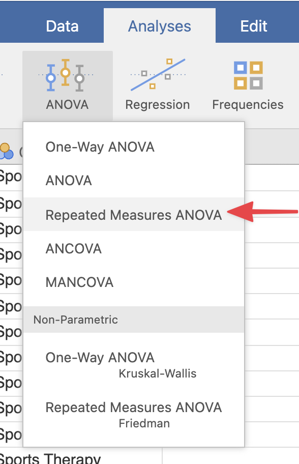

We'll be looking at how VO2max changes between attempts (within-subjects) and between genders (between-subjects).

Similar to the one-way repeated-measures ANOVA, we need to tell Jamovi the name and levels of our within-subjects variable. Click the **RM Factor 1** label in the right hand box and replace it with **VO2max**, then click **Level 1** and replace it with **Attempt 1**, **Level 2** with **Attempt 2**, and **Level 3** with **Attempt 3**.

You should see your changes reflected in the Repeated Measures Cells box underneath - now drag the three VO2max variables into that box, one for each level.

Finally, drag **Gender** into the **Between Subject Factors** box. Your final menu should look like this:

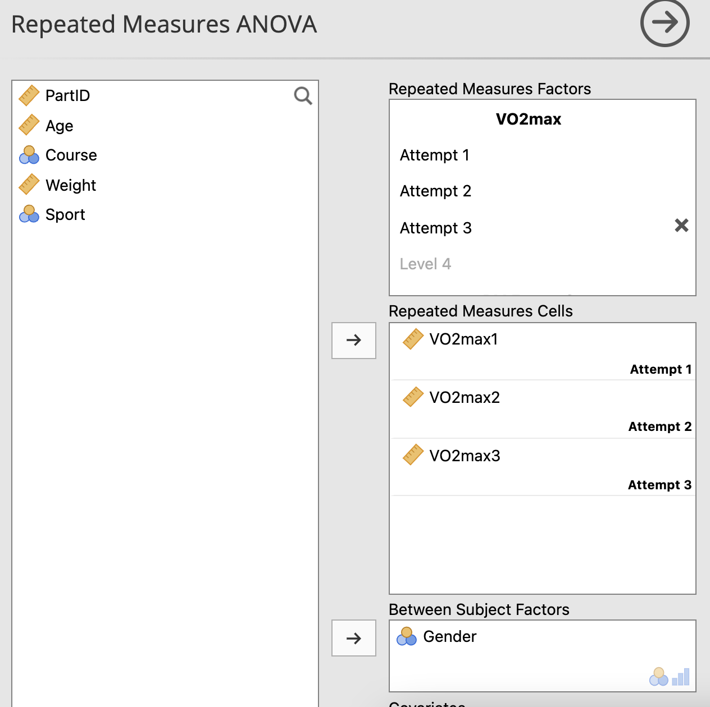

Scroll down to the **Assumptions** dropdown menu and tick **Sphericity tests** and **Homogeneity test**.

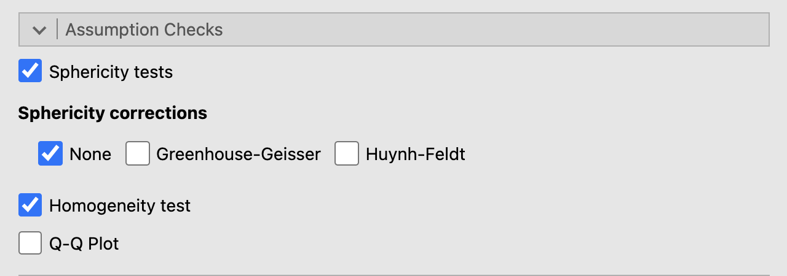

Let's look at those assumption results first:

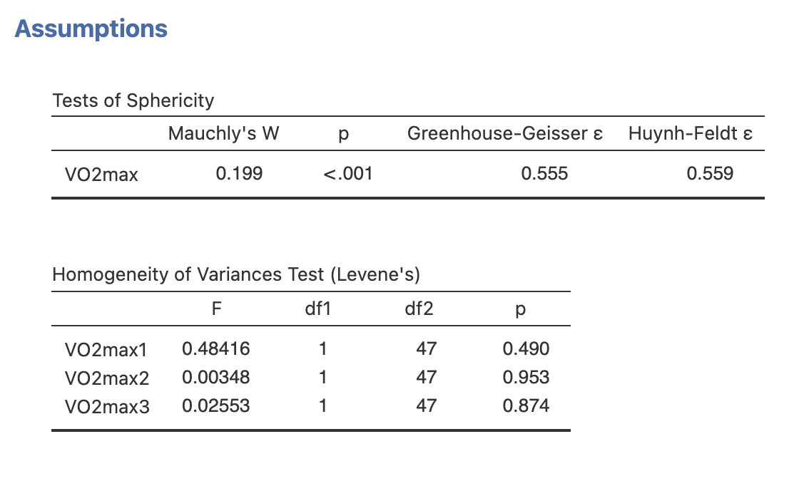

We can see that none of our Levene tests results in a significant *p* value, so we know our male and female groups for each VO2max attempt are homogeneous in variance. But, our sphericity test does have a significant result (*p* < 0.001), which means we need to apply a correction to our ANOVA results.

Back in the Assumptions menu, untick 'None' and tick the 'Greenhouse Geisser' option.

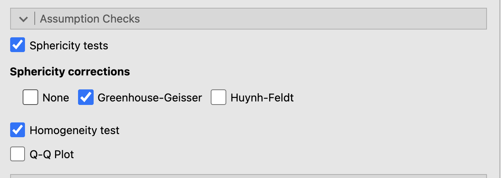

This will update our ANOVA table results. Let's look at those now:

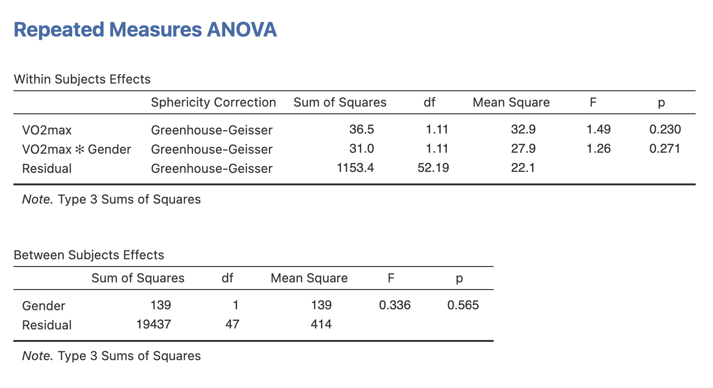

You can see that the results are split, with a table for our Within Subjects effects, which includes the interaction effect, and our Between Subjects effects. You can see that the Sphericity Correction has been applied. Turns out none of these have resulted in a significant *p* value, so normally we'd be done with our analysis at this stage!

## Mixed design post-hoc tests and plots

If any of our effects had been significant at ANOVA, we would do some post-hoc testing. This is done in the exact same way as the Factorial ANOVA above - so under the **Post Hoc Tests** dropdown menu further down the ANOVA menu, move any our significant results into the right-hand box, pick your post-hoc correction, and tick the option for Cohen's D under Effect Size.

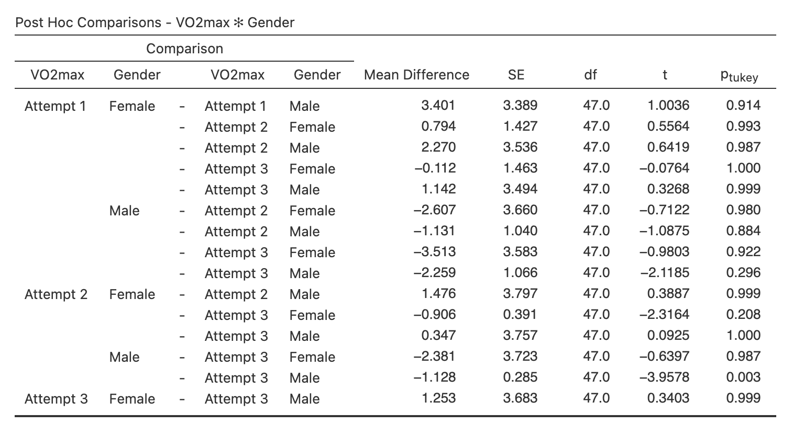

::: Warning

Wait a second! There's a single significant *p* value result in there - between Male Attempt 2 and Male Attempt 3. Well, remember the details about alpha inflation and running many comparison tests at once - even with adjustments, we can get random significant differences pop up like this. This is a good example of why ANOVA is important for looking at the bigger picture before diving into many different comparison tests - just because one male attempt is different to another male attempt, doesn't mean that *overall* there is a difference between attempts or genders.

:::

We can also check out some plots for our data - head to the **Estimated Marginal Means** dropdown menu in the ANOVA menu, Move both **VO2max** and **Gender** into the box titled **Term 1** on the right hand side, and tick the **Marginal Means Plots** option underneath.

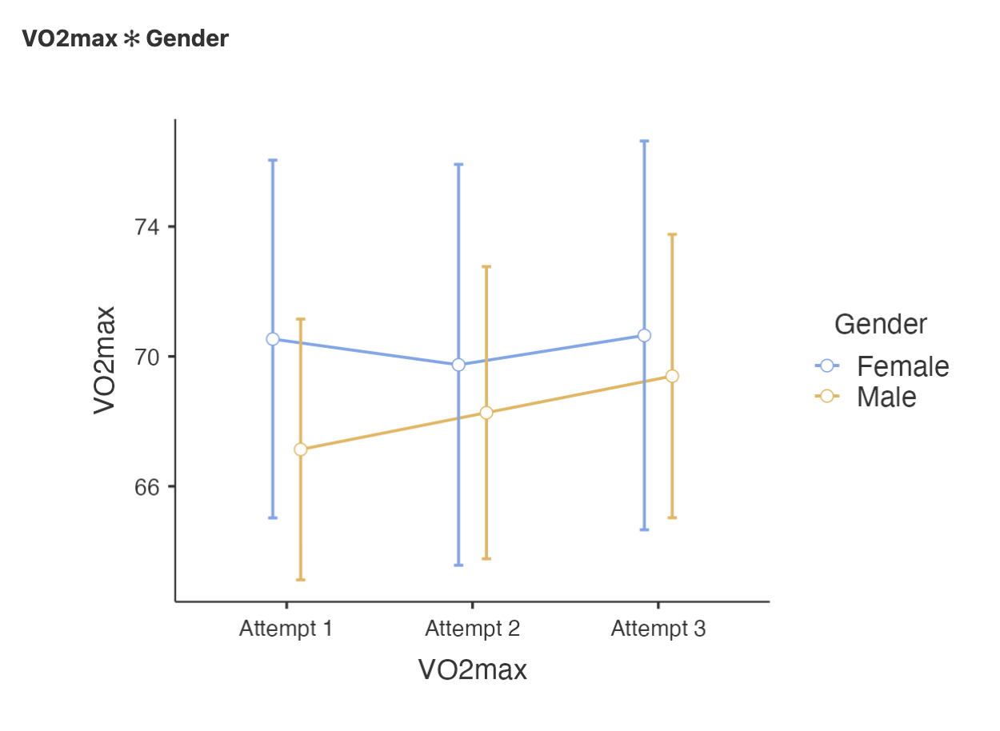

We can see in our interaction plot that none of the lines cross, indicating no interaction between attempt and gender. If we look at just the main effects, we see a similar story:

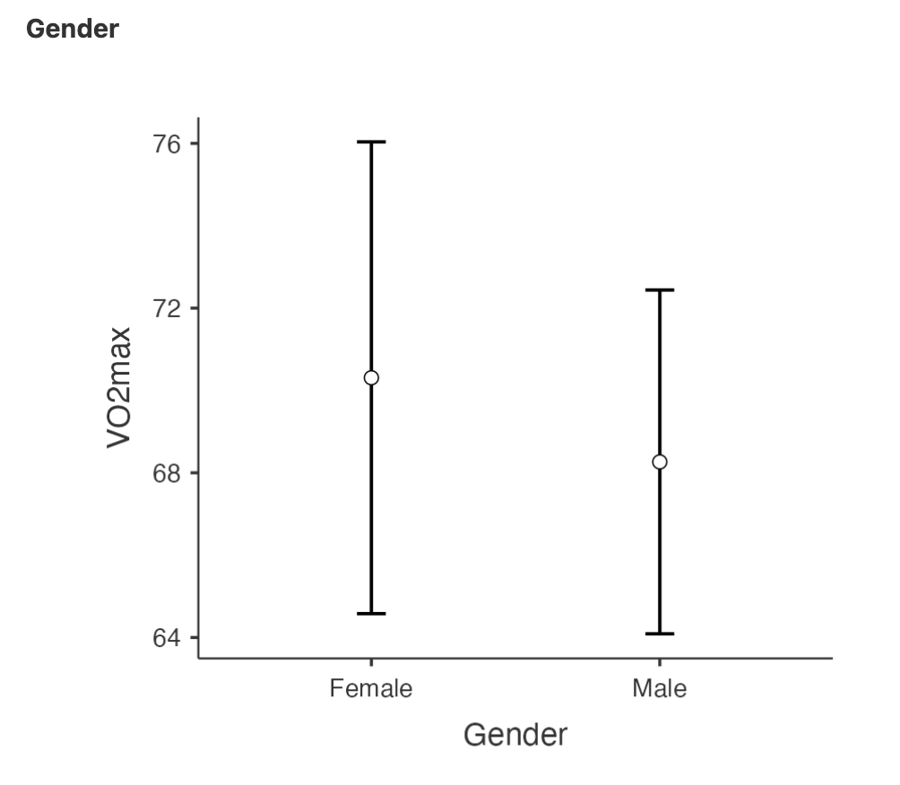

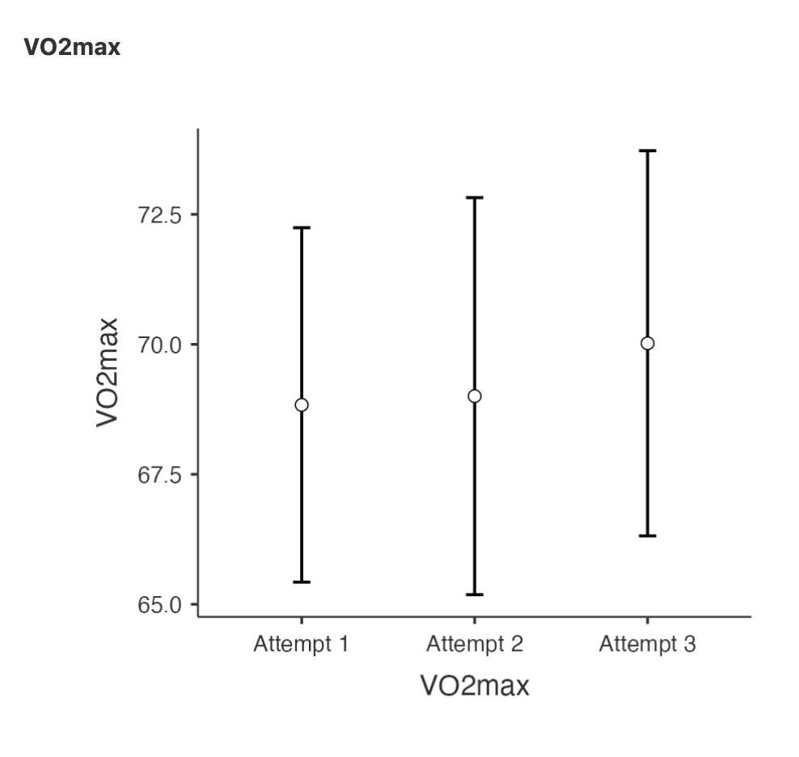

The confidence intervals for all these groups overlap quite a lot, indicating no significant difference between groups.

## More ANOVA

Don't forget that other types of ANOVA are possible in Jamovi, including MANOVA, with multiple dependent variables, and ANCOVA, which includes covariates. We don't look into these but if you're interested for your own project work, some details can be found:

**MANOVA**

- [MANOVA in Jamovi on YouTube](https://www.youtube.com/watch?v=doTm20CvxE8)

**ANCOVA**

- Chapter 14.5 of [Learn Stats with Jamovi](https://www.learnstatswithjamovi.com/) book
- [ANCOVA in Jamovi on YouTube](https://www.youtube.com/watch?v=d_SYORH6tUg)