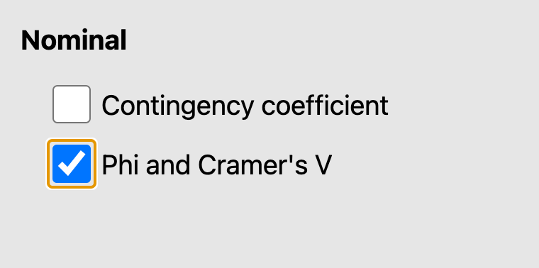

\wordtoc

## Assumptions for chi-squared

It should be obvious that we will not be making use of parametric assumptions when performing a chi-squared test. For example, categorical data cannot be normally distributed. There are however three assumptions that should be confirmed.^[Field, 19.4, Assumptions where analysing categorical data, p. 735.]

1. **Low level data:** As can be expected from the introduction, your two variables should be measured at an ordinal or nominal level (i.e. categorical data).
2. **Expected frequencies:** In a 2x2 contingency table (sometimes referred to as a cross-table, see below for an example), no **expected** value should be less than 5. We will see this in action later when we actually work out some expected frequencies, but essentially an expected frequency is how many members of a cell you would expect to see given the overall size of rows and columns. If any expected frequency is less than 5 we should group together either rows or columns to increase the expected value.
3. **Independence:** Each item in the contingency table within each element can only exist in one element. For instance in the below table of gender and course, a student can only be in 1 gender row, and participating on 1 course column.

Each numerical cell shows the number of students who fall into that particular gender/course combination, for instance there are 3 female students who take Sport and Dance Therapy, yet there are 25 male students who take sport and Exercise Science.

In this practical you are going to look at 4 examples of the chi-squared test, gradually building in more parts of the chi-squared process.^[Field, 18.5, Doing chi-square in SPSS, p. 736]

## Pearson's chi-squared test

In this test we just want to see in one year group of students if there is anything ‘strange’ in our data, or whether there is an association between our categories variables. We should expect that there is a 50/50 split of students **between** each course, and **within** each course there will be a 50/50 split of male and female.

Open **CourseAttendee.omv**, and the data will appear as below:

In this example we just have two courses and two genders. The file will allow more courses to be added when students start to enrol.

::: Questions

[Q1]{}. What data type is gender, and what values for it are represented in the data?

[Q2]{}. What other course names can be used in the CourseID column?

[Q3]{}. How many male/female students take part in each course?

:::

For an easy way of answering question 3 above, we can get Jamovi to create a **contingency table** for us, similar to the one we saw above when discussing assumptions.

Click **Analyses**, then **Frequencies**, then **Independent Samples**.

::: Tip

See the symbol χ under the text 'Independent Samples'? That's the Greek letter chi, so χ^2^ is just a short-hand way of saying 'chi-squared'.

:::

In the menu that pops up, drag **Gender** into **Rows** and **CourseID** into **Columns**.

And as easy as that, our contingency table shows up in the results - with the gender labels Male and Female as our rows, and the CourseIDs as our columns. The numbers within each cell therefore tell us how many people are in each combination of Gender and CourseID group.

We can confirm our answer to question 3 now - there are 7 males in Sports Therapy and 5 in Sport and Dance Therapy, with 8 females in Sports Therapy and 8 in Sport and Dance Therapy.

::: Aside

This is a **2x2** contingency table, because there are two levels to each category. It's arguably the most common and the easiest to interpret, but you can also have contingency tables with more levels in a category, as we saw earlier in the worksheet.

:::

You can also see the totals for each row and column at the sides and bottom of the table, and our overall data total in the bottom-right corner. So there were 12 males and 16 females in total in our data, 15 students are on Sports Therapy and 13 are on Sport and Dance Therapy, and our data consists of 28 students in total.

What we are interested in now is whether there is anything *out of the ordinary* in terms of the number of student in each of the contingency table cells. Is there a specific interaction effect between course and gender?

For instance if 50% of Sports Therapy were Male and 52% of Sports and Dance Therapy were Male, we would say the course enrolment is similar across gender. But what happens if only 10% of Sports and Dance Therapy are Male – would this allow us to say the gender split by course is significantly different?

Let's look at our contingency table again. While it looks like there are more females than males in the Sport and Dance Therapy class, is it a *statistically significant* difference?

This is the aim of the chi-squared test.

::: Questions

[Q4]{}. What would be your null and experimental hypotheses for this data?

:::

Before we run the test, let's turn on some more information in our contingency table. Click the **Cells** menu in the setup menu for the contingency table, and tick every checkbox available.

We've added quite a bit to our table now:

Let's go through it:

- Observed: the actual data we collected, this is the number of students we know to be in each cell (course/gender).
- Expected: this is the number that we would *expect* to be in each cell if the numbers were split *evenly*. We calculate this as the expected value across the whole population. For instance, the expected number of male sports therapists = (total sports therapy) * (total male) / (overall total students) = (15*12)/28) = 6.4, i.e. in this sample, we would expect there to be 6.4 male students studying sports therapy. This is also how we check our assumption about the expected frequency.
- Row, Column, and Total percentages: it is often easier to consider percentages than actual frequencies. This can often help when we are comparing different sample or category sizes.

You can turn these extra numbers on and off as needed - for example, if you are more interested in the gender split than the course split, you might only turn on percentages for rows so you can focus on those.

::: Questions

From the contingency table:

[Q5]{}. How many female students are studying Sports Therapy?

[Q6]{}. How many female students would we have *expected* to be studying Sports Therapy?

[Q7]{}. What percentage of the overall sample were males studying Sports and Dance Therapy?

[Q8]{}. What percentage of combined sports therapists were female?

:::

Let's finally look at our chi-squared test results. Under the **Statistics** dropdown menu, tick the box for χ^2^, and make sure the Hypothesis check box is next to 'Group 1 ≠ Group 2'.

::: Tip

The box was probably already ticked when you opened the menu, but just double check!

:::

You should see the test results table pop up in the results viewer.

As with other tests we have the test statistic (0.19, the actual chi-squared stat), the degrees of freedom (df, calculated as [number of rows - 1] x [number of columns - 1], so in our case here, 1 x 1 = 1), and the 2-tailed *p* value (0.662).

The Chi-squared test examines whether there is an *association* between the two categorical variables of gender and course. If the significance value is small enough, i.e. less than our usual alpha of 0.05, then we reject the null hypothesis that the variables are independent and have some confidence that the values are in some way related.

Here we can see that the *p* value is greater than 0.05, so will accept the null hypothesis that there is no interaction / association / relationship (you might see it referred to a few different ways, but they mean the same thing) between course and gender. Which is to say, you could not *predict* which course a student is likely to be on if all you knew about them was their gender.

::: Aside

You may spot under the statistics menu an option for 'χ^2^ continuity correction'. This is sometimes known as Yates' correction, and is a way of correcting overestimation of the χ^2^ result in small samples. Statisticians still argue over whether it should be used or not and for what cases, so we'll not worry about it for now, but you can try ticking it and see how the result it produces differs from regular χ^2^.

:::

## Analysing chi-squared further

Now load **CourseAttendeeGenderBias.omv**. As you may guess from the name, the data has been tweaked to make it look like there **is** a difference.

Rerun the same Chi-Squared analysis and answer the following questions:

::: Questions

[Q9]{}. How many participants are there in total in this data set?

[Q10]{}. How many participants are included in the analysis?

[Q11]{}. How many males are in the analysis?

[Q12]{}. How many observed males in sports therapy and how many expected?

[Q13]{}. What is the calculation for the expected females in sport and dance therapy?

:::

Finally, we need to be able to report the results of the chi-squared test. Now we know it is significant, we can look at the values within the cells for each group and make some common-sense inferences about what the numbers mean. So for this test we could write:

::: Success

There was a significant association between the class type and gender, χ^2^(1) = 3.89, *p* = 0.049. Gender appears to inform which course a student will enrol in, with Males more likely to enrol in Sports Therapy and Females more likely to enrol in Sport and Dance Therapy.

:::

## Effect size

Effect size for χ^2^ couldn't be easier. In the **Statistics** menu, under **Nominal**, simply tick **Phi and Cramer's V**. These should pop up in our results viewer.

These are similar to Cohen's *d* and Hedge's *g* from previous worksheets, in that Cramer's V is an adjustment of Phi. They can be read as ranging between 0 (no association between variables) and 1 (perfect association). Cramer's V is usually used, as some strange quirk of calculation means Phi can actually exceed 1 when you have contingency tables larger than 2x2, and Cramer's V just adjusts it to always fall between 0 and 1. In this case, as our table **is** 2x2, they are the same.

## Odds ratio

One other way we can see how the groups are related is by looking at the **odds ratio** for our contingency table. This is only possible for 2x2 contingency tables, like we have here.

The odds ratio tells us the odds that a single participant from either **row group** will be in the **first column group**. That might sound a little confusing, so let's go through it. First, in the **Statistics** menu under **Comparative Measures (2x2 only)**, simply tick the **Odds Ratio** check box, and untick **Confidence intervals** if it's selected to make things clearer. The odds ratio table will appear under our χ^2^ table in the results.

The odds ratio is calculated as the odds of someone from one group of one category (gender) being in a certain group of the other category (course). It is calculated depending on how the data is laid out in the contingency table, as follows:

**Odds ratio = ( A x D ) / ( C x B )**

Because of this calculation, cell A - male and sports therapy - becomes the main cell we are comparing against. We can therefore read our odds ratio result of 4.4 as, "males were 4.4 times as likely as females to be sports therapists rather than sport and dance therapists".

This might seem strange at first, as looking at our raw observed figures '10 male sports therapists' is not 4 times larger than '5 male sport and dance therapists'. But this is because the odds ratio is not a direct comparison of our figures in this way. Odds can definitely get a bit confusing, so we won't look at it in a lot of detail, but briefly the odds ratio is defined as:

**The ratio of the odds of A in the *presence* of B, and the odds of A in the *absence* of B. Two events are independent if the odds ratio equals 1, i.e., the odds of one event are the same in either the presence or absence of the other event.**^[See [https://finnstats.com/index.php/2022/02/07/odds-ratio-interpretation-quick-guide/](https://finnstats.com/index.php/2022/02/07/odds-ratio-interpretation-quick-guide/) for a walkthrough.]

This is why the odds ratio can only be calculated in a 2x2 table, as we are technically calculating the ratio between the odds of being male and a sports therapist, and the odds of being male and **not** a sports therapist. Because there is only one other group in each variable we can then just interpret these **not** groups as 'female' and 'dance therapist'.

We can reverse the reading of our odds ratio by taking the **reciprocal** of it, by calculating:

**1 / Odds Ratio**

Which in this case is:

**1 / 4.4 = 0.23**

Which can be read as, "females were 0.23 times as likely to be sports therapists than males." As this number is less than 1, we can see this means they were less likely to be sports therapists than males.

Setting up your data to answer the specific question you have in mind is therefore important for the odds ratio calculation - you could, for example, swap the gender data labels so that Female becomes the first row to be compared against, in which case our odds ratio result in Jamovi would jump straight to the 0.23 result given above and we'd need to take the reciprocal to get our original 4.4 answer.

::: Aside

You might spot the 'log odds ratio' in the statistics menu options. This is similar to the odds ratio, but standardised so that positive odds are always positive numbers, negative odds are always negative numbers, and the distance between odds are standardised. It can be useful when you are comparing odds between data sets that may be different sizes. You can read more about it here: [https://www.geeksforgeeks.org/log-odds/](https://www.geeksforgeeks.org/log-odds/)

:::

## More than 2x2 contingency tables

Finally, repeat the above processes, but use **CourseAttendeeAllYearsGenderBias.omv**. Ignore the fact that there are 3 years of data in this file, simply analyse the total number of males and females split across the range of courses in the file. This is a little more complex as there are 4 courses, but use the same steps to answer the below questions. 

::: Questions

[Q14]{}. How many cases are in the data file and how many are included in the contingency table?

[Q15]{}. Are there any ‘invalid’ records that are excluded from the analysis, and what does this value tell you about your data? 

[Q16]{}. How many males in the total sample?

[Q17]{}. How many females were observed in the Sport and Exercise Science course?

[Q18]{}. We now have 4 courses in this data set and 168 cases in the sample. What is the expected number of male students taking sports therapy, and female students taking sport psychology? Show the calculation for this.

[Q19]{}. What are the degrees of freedom for this test? 

[Q20]{}. What is the c2 statistics for the test

[Q21]{}. What is the p value for the test?

[Q22]{}. Write down a sentence to show how you would report this χ^2^ test.

[Q23]{}. What are the effect sizes for this test?

[Q24]{}. Can we calculate an odds ratio for this data? 

:::

## Weight cases

One slightly different way of setting up frequency data you might encounter is using **weight cases**. Here, the observed counts for each group are explicitly entered as data, rather than just counting up the rows in our spreadsheet. 

To see what this means, open **CourseAttendeeFrequencies.omv**. Notice now that our CourseId and Gender columns only contain one entry for each combination, with the Frequency column now telling us how many people are in that group.

To use data setup in this way in Jamovi, head to the **Independent Samples** menu and setup CourseID and Gender in the rows and columns boxes as before, but now also drag Frequency into the **Counts** box.

The results viewer should update to show a similar table to before, and you can carry out the rest of the analysis in the same way as above.

\newpage

## Answers to questions

::: Questions

[A1]{}. Gender is nominal data, assign a word as a label to a characteristic. In this instance our data just contains 'male' and 'female'. Remember that in the real world, other genders may be given.

[A2]{}. 4 courses have been created: 1 = Sports Therapy, 2 = Sport and Dance Therapy, 3 = Sport and Exercise Science, 4 = Sport Psychology, Coaching and Physical Education. You can see these by clicking into the CourseID column, then under the 'Data' menu, clicking 'Setup' to see the levels of data that have been created.

[A3]{}. 7 males take part in Sports Therapy, 5 in Sport and Dance Therapy. 8 females take part in Sports Therapy, and 8 take part in Sport and Dance Therapy.

[A4]{}. Our null and alternative hypotheses for this setup would be:

H~0~: there is no significant relationship between gender and course.

H~1~: there is a significant relationship between gender and course.

[A5]{}. 8 female students were studying Sports Therapy.

[A6]{}. The table shows we would have expected 8.6 students to be taking Sports Therapy.

[A7]{}. As a percentage of the *overall sample*, 17.9% were males studying Sport and Dance Therapy.

[A8]{}. As a percentage of *sports therapist*, 53.5% were female.

[A9]{}. There are 32 participants/cases in this sample. Remember to look at the case values, not the participant id.

[A10]{}. There are 31 ‘valid’ cases in the analysis. One case is missing from the analysis as it does not have a gender.

[A11]{}. There are 15 males included in the analysis.

[A12]{}. In Sports Therapy, there are 10 observed males, and 7.3 expected males.

[A13]{}. The calculation for expected females in Sport and Dance Therapy is given by:

- (Total Female * Total Sport and Dance Therapy) / (Overall Total)
- (16 * 16) / 31  = 8.25, rounded up to 8.3 expected females on Sport and Dance Therapy.

[A14]{}. 168 cases are available in the data files, and all 168 are valid (i.e. included in the analysis).

[A15]{}. There are no ‘invalid’ records, this says that every case must have a Gender and CourseId.

[A16]{}. 82 observed males are in the sample.

[A17]{}. 7 observed females are taking Sport and Exercise Science.

[A18]{}. Expected(Male:Sport Therapy) = Total (Male) * Total (Sport Therapy) / Overall total

= 82 * 42 / 168 = 20.5

 Expected(Female:Sport Psychology) = Total (Female) * Total (Sport Psyc) / Overall total

= 86 * 42 / 168 = 21.5

[A19]{}. Degrees of freedom = (Rows – 1) * (Columns – 1) = (4-1) * (2-1) = 3

[A20]{}. χ^2^ = 35.54

[A21]{}. *p* < 0.001. Remember you cannot just say zero!

[A22]{}. There was a significant association between the gender of the student and the course they took part in c2(3) = 35.544, *p* < 0.001.

[A23]{}. V = 0.46. You might find Jamovi won't give you Phi, as this isn't a 2x2 contingency table.

[A24]{}. No, we can't calculate the odds ratio as this isn't a 2x2 contingency table.

:::
