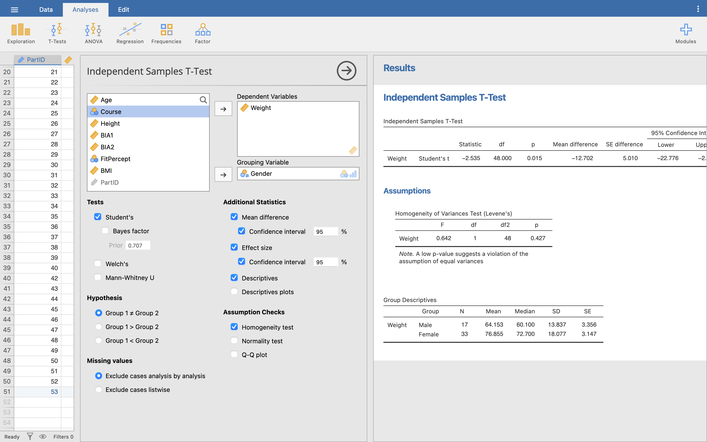

\wordtoc

## Independent groups

If you have two groups that are **not** related - i.e. they are completely separate people, or independent measures - you can use the following tests to compare them:

- Independent measures Student's *t*-test for parametric data
- Independent measures Welch's *t*-test for parametric data, but uneven sample sizes or unequal variances
- Mann-Whitney U test for non-parametric data

### Setup

Open up the **Body Compsosition.omv** file from previous weeks and clear your Results viewer of any previous results, so we can start fresh. Make sure you've saved the additions we did in Week 1, with PartID 53.

::: Aside

We won't be going over every little detail for tasks like this that we've done in previous weeks - if you can't remember how to do anything, go back and review the previous worksheets.

:::

### Independent measures Student's *t*-test

For this first test we are going to go back to the **Weight** and **Height** data. We have 50 participants in our data set, and you can see from **Gender** we have two levels, 1 (Male) and 2 (Female). We are interested in these students to see: who is heavier, male or female?

At its very simplest, examining the mean and standard deviation will give us ‘an’ answer to this question. Click **Analyses**, then **Exploration**, then **Descriptives**. Move **Weight** into variables, and split by **Gender**. Go into the **Plots** option and turn on **Box plot** too.


::: Questions

Q1. What is the mean weight of males and females?

Q2. What is the standard deviation of males and females?

:::

It should be clear from the boxplot that the females are heavier than males, but notice that the spread of females is greater than males, so simply using the mean (or any other measure of central tendency) does not give the full story.

::: Questions

Q3. Before we can run a parametric test, what are the 4 conditions we must satisfy?

Q4. Run a test for normality while in the Descriptives menu - what values do you get, and does this satisfy the appropriate parametric test?

:::

Assuming we have parametric data here, let's do the independent samples *t*-test. In **Analyses**, click **T-Tests**, then **Independent Samples T-Test**. Move **Weight** into the dependent variables box and **Gender** into the grouping variable selection box.

Under **Tests** under the variables selection boxes, make sure **Student's** is ticked.

::: Aside

The *t*-test is sometimes called Student's *t*-test, named after the person who invented it. Although his name wasn't actually Student - his real name was [William Sealy Gosset](https://www.encyclopedia.com/people/social-sciences-and-law/sociology-biographies/william-sealy-gosset), but he wasn't allowed to publish his work under his own name, so he used the pseudonym Student.

:::

Underneath **Tests** is the **Hypothesis** section. We don't have a prediction of which group might be heavier yet, so make sure **Group 1 ≠ Group 2** is ticked. This just means that we are testing is Group 1 (Male) is not equal to Group 2 (Female), but it doesn't matter which one is heavier than the other, only that they are different.

::: Aside

If we had a prediction that Males would be heavier than Females and **only** wanted to test for that, we would tick **Group 1 > Group 2**. This would not give us a significant result if they were the same weight, **or** if Females were heavier than Males.

:::

While we're here, under **Additional statistics** tick **Mean difference** and **Effect size** boxes, both with the **Confidence interval** box ticked (leave both at 95%), and **Descriptives**.

Under **Assumption checks** tick **Homogeneity test**.



Let's look at our Results. Starting with the **Group Statistics** table, you can see the same basic information that we found in the Descriptives from before (SD - standard deviation, SE - standard error of the mean).

Under the **Assumptions** heading, we can also see our **Levene's** test results for homogeneity of variance.

::: Questions

Q5. Does our data meet the assumption of homogeneity of variance?

:::

::: Aside

If your variances are not equal, or you have uneven group sizes, but your data is still normal, don't fret - just untick **Student's** and tick **Welch's** instead. Then, carry on with the steps in this worksheet exactly the same.

:::

The **Independent Samples T-Test** table in our Results viewer shows us the outcome of our *t*-test. Reading from the top line, we are mostly interested in the *p* value. Here the *p* value is 0.015, so there is strong evidence to suggest that the difference in weight between male and female is > 0 kg. The mean difference shows that the average difference in weight between the groups in our sample is 12.7 kg.

::: Aside

Remember the difference between a **sample** (the data we have collected) and a **population** (the entire possible group of people everywhere we could have collected our data from). The 95% confidence interval for the mean shows that the difference in weight between the **populations** is somewhere between 2.6 and 22.7 kg. The smaller the confidence interval, the more confident we can be that our sample statistic - mean difference - truly represents the same statistic in the population our sample is drawn from.

:::

Finally, we can look at the effect size. We can calculate Pearson’s correlation coefficient (*r*) for *t*-tests, similar to correlation, but the more common reported effect size for *t*-tests is Cohen’s *d*, and this is what Jamovi reports. We can interpret the values for Cohen's *d* from the Results viewer based on the below table of commonly used criteria:

| Cohen's *d*     | Interpretation       |
| --------------- | -------------------- |
| *d* < 0.2       | Trivial / negligible |
| 0.2 < *d* < 0.5 | Small                |
| 0.5 < *d* < 0.8 | Moderate             |
| 0.8 > *d*       | Large                |

::: Aside

**Note:** Unlike *r*, Cohen’s *d* can go above 1 for a particularly large effect size.

:::

**Now you try**: Repeat the independent measures *t*-test for **Height** across gender using this data set.

::: Questions

Q6. What is the null and experimental hypothesis for this test?

Q7. Is this data parametric?

Q8. Which test should you run and why?

Q9. What is it about the layout of the data that suggests this test?

Q10. When you run the t-test, what is the result of Levene’s test for Equality of Variance and what does this mean?

Q11. What is the p value for the Independent Measures T-test and again what does this mean?

Q11. What is the effect size of this result?

Q12. How would you report these results in your essay / coursework / dissertation?

:::

### Mann-Whitney U test

Continuing with the **Body Composition.sav** dataset, we are going to look at a comparison of non-parametric data. We are still comparing two independent groups (males and females), but this time we want to see if there is a difference in the self-perception of fitness between males and females, where the self-perception of fitness is measured on a Likert scale between 1-5 where 1 is completely unfit, and 5 is very fit.

::: Aside

Remember that this is a **Nominal** data variable, that has been labelled - so the underlying data is the numbers 1-5, but the column is showing the labels "Very unfit", "Somewhat unfit", etc. "Very unfit" is 1 and "Very fit" is 5. You can view the levels in the data variable setup menu - see the Descriptives worksheet for details if you need a reminder.

:::

For the non-parametric test, we do not have the strict parametric assumptions of the independent measures t-test. But, as with the parametric data, it is possible to perform a little exploratory analysis. In **Analyses**, go back into our **Descriptives** menu.

As this is a nominal variable, we can't use some of our usual data points but we can still usefully use some. Click **Frequency tables**, **N**, **Missing**, **Mode**, **Minimum** and **Maximum**. Under **Plots**, click **Histogram**.

Let's look at these in the Results viewer.


We can see in the Descriptives that we have one Female that did not provide a fitness perception (missing = 1). We can see that for both groups, we can see with the mode that the most common response was 3 ("Neither fit or unfit"). The minimum value of 2 for Males means that no Male rated themselves as "Very unfit", and from the maximum that both groups had people who rated themselves "Very fit". Finally, the frequency tables and histogram both show us how the groups break down across the fitness levels.

Let's do the comparison test. Go back to the **Independent Samples T-Test** menu from before. Now, simply untick **Students**, and tick **Mann-Whitney**. Turn on **Mean difference**, **Effect size**, and both the **Assumption** tests too.


::: Questions

Q14. We already made the decision to run a non-parametric test on this data for this worksheet, but if we were analysing this data for real, what would lead us to treat this data as non-parametric from our assumption checks?

:::

The table for our independent samples test results can be read in much the same way as before. Instead, we only really care about the *p* value. Here, *p* < 0.05, so we can conclude there is a significant difference between the overall fitness perceptions of each group.

The mean difference is 1, and the two means are in the **Descriptives** section. We can see from the means that Males have an average higher perception of their fitness than Females.

For an effect size, as our data is non-parametric, we can't use Cohen's *d*. Instead, Jamovi uses Rank biserial correlation. Rank biserial correlation is similar to *r*. They're both correlations, and like *r* it can run from 0 to 1. It's less easy to interpret, but you can treat it like *r* - the larger number, the better.

::: Aside

You can read more about [Rank biserial correlation here](https://en.wikipedia.org/wiki/Mann%E2%80%93Whitney_U_test#Rank-biserial_correlation).

:::

**Now you try**: Repeat the non-parametric Mann-Whitney U for self-perception of fitness. This time, we want to see if there is a difference in the perception of fitness between the therapists (dance and sport) versus the sports scientists (both sports science and sports psyc, coaching and PE).

As we have 4 groups, you will first need to create a new variable called **PerceptionGroup**. We can use the **Transform** menu to create a new variable that gives participants a 1 if they are on a therapy course or a 2 if they are on another course, and label 1 'Therapy' and 2 'Other'.

Click **Data**, then **Transform**. Call the variable **PerceptionGroup** and give it an appropriate description. Set the **Source variable** to the **Course** variable, then click the **using transform** dropdown menu and click **Create new transform**.


In this new menu, we need to create a formula to tell Jamovi how to create our new variable, similar to the **Compute** menu from the Descriptives worksheet. Call the new transform something useful and give it an appropriate description. Then, click **Add recode condition**.

Set our recode condition (the top box) to say that if the Course ID is less than or equal to 2 (remember Sport Therapy is 1 and Sport and Dance Therapy is 2), use the word 'Therapy' in the transformed variable. Otherwise, use the word 'Other'.


Press enter, then use the arrows in the top right corners of the Transform menus to close the menu. You should see the new column named **PerceptionGroup** with 'Therapy' or 'Other' written in it.

Now run the non-parametric Mann-Whitney U for self-perception of fitness between the therapists ('Therapy') versus the sports scientists ('Other').

::: Questions

Q15. What are the null and experimental hypotheses for this test?

Q16. What is the name of the test you are running?

Q17. What is the median perception of fitness for therapists and non-therapists?

Q18. What is the mean perception of fitness for therapists and non-therapists?

Q19. Running the Mann-Whitney U test, what is the *p*-value and what does this mean?

Q20. What is the effect size?

Q21. How would you report these results in your essay / coursework / dissertation?

:::

##  Repeated measures groups

If your two groups that **are** related - i.e. repeated measure groups - you can use the following tests to compare them:

- Repeated measures *t*-test for parametric data
- Wilcoxon signed rank test for non-parametric data

### Setup

The repeated measures *t*-test allows us to compare two experimental conditions where the same participants take part in both conditions. We are going to examine some sit and reach data, so open **Sit and Reach.omv**.

In this study, 20 participants were selected, 10 male, 10 female. Their sit and reach score was measured (in cm) at the start of the test (SnRPre) and after a 5 week intervention, their flexibility was tested again (SnRPost). A score > 0 means the participant can reach further than their toes, < 0 means they cannot reach their toes.

::: Aside

As this is a repeated measures test, when testing our parametric assumptions, we need to check the **difference scores** between the two variables. These can be calculated with the **Compute** menu by subtracting post scores from the pre scores (SnRPost - SnRPre).

:::

::: Questions

Q22. What type of data is gender?

Q23. What do the numbers 1 and 2 represent?

Q24. What is the mean and standard deviation pre-sit and reach score for males and females, and based on your sports science knowledge was this expected?

Q25. What is the Shapiro-Wilk Score for the sit and reach score? What does this mean?

:::

### Repeated measures Student's *t*-test

Assuming that the data satisfies our parametric assumptions we will run a paired samples *t*-test. Click **Analyses**, then **T-Tests**, and **Paired Samples T-Test**.

This new menu should look very similar to the independent measures *t*-test from before. The main difference is that we need to add two variables to the **Paired Variables** box, and they appear side-by-side to show that they are the two variables being compared.

Move both **SnRPre** and **SnRPost** into the box now. Tick **Student's**, and then **Mean** and **Effect size** with their confidence intervals, **Descriptives**, and **Normality test**, similar to the independent test.


::: Aside

Notice that because this is repeated measures, there is no Levene's test option now, and the Shapiro-Wilk test is being performed on the difference scores as we noted above.

:::

We are mainly interested in the first and third output table in our Results viewer. The Descriptives gives us the mean and standard deviation (SD) of the two groups, with the final column giving us the standard error (SE) of the mean (which shows us how far the sample mean deviates from the population mean – generally the smaller the better).

The first table then gives us our *t*-test result. Let's look at it in more detail, going through each results column from left to right:


- **Statistic:** the actual *t*-statistics. This is the test statistic which Jamovi uses to calculate the significance. The *t*-statistic is based on the mean score (-1.97) divided by the standard error of the differences (0.481).
- **Df:** degrees of freedom – basically sample size minus 1.
- **p:** Significance of the *t*-test. In this case, we are saying is there is only a 1% chance that this value of *t* this big could happen if the null hypothesis were true (i.e. that the means are equal). Alternatively, as the *p* value is < 0.01 we should reject the null hypothesis at the 1% level, suggesting there is strong evidence against the null hypothesis and that we should accept the alternative hypothesis that there is a difference in the pre and post sit and reach results. From the means of the two groups we can infer that the post sit and reach value is greater than the pre sit and reach score.
- **Mean difference:** This is the mean difference of the two variables. As the post sit and reach score is generally greater than the pre sit and reach score, our mean difference is negative, or rather the average increase in sit and reach score is approx. 2.0cm.
- **SE difference:** The standard error of the mean.
- **95% confidence intervals:** The range of values that the mean difference of the population is 95% likely to be within, given the statistics calculated from our sample. As we only have a sample of data, these two fields give us a 95% confidence interval for the population mean difference, so if we took 100 such samples, then the mean difference of 95 of those samples would be between 0.97 and 2.98 cm. Because this range does not cross zero, the interval here tells us that based on our sample the true value of the difference between the means is unlikely to be zero. Therefore we can conclude that the difference *is* greater than zero, backing up our *p* value result.
- **Effect size and confidence intervals:** Similar to Cohen's *d* in the independent *t*-test. Here, the effect size is *d* = 0.92, a large effect size.

To report the paired samples *t*-test results, we could write this as:

On average, participants experienced greater sit and reach scores after intervention (*M* = 8.10, *SE* = 1.11) compared to before intervention (*M* = 6.13, *SE* = 0.94), *t*(20) = -4.106, *p* = 0.001, *d* = 0.92.

**Now you try**: Keep with the same data set, but only examine the sit and reach scores of the **Male** participants. To do this, we will need to create a **Filter** on our data, to only include participants where **Gender** is Male in any tests we run.

Click **Data**, then **Filters** (the icon looks like a funnel). This is simpler than the Compute/Transform variables - just type the filter condition straight into the function box. We can use either the numbers underlying our Gender data, or just type the label we want itself. So, enter in the function box:

```
Gender == 'Male'
```


Notice how the Filter has been applied in a new column named **Filter1**. There should be green ticks next to all the Male participants, and red crosses next to all the Female participants. This shows us that only the Male participants will be included in our tests.

::: Aside

To turn a Filter on or off, go back into the Filter menu, and then just toggle the little green **active** switch.

:::

Now run the paired-samples *t*-test again.

::: Questions

Q27. What is the null and experimental hypothesis for this test?

Q28. Is the data parametric? (Remember for the repeated measures *t*-test, we consider normality of the difference between pre and post, and level of data.)

Q29. What is the mean and standard deviation sit and reach score in the pre and post condition for males?

Q30. What is the 95% confidence level for the mean difference between the pre and post reach for males?

Q31. What is the *t*-value?

Q32. What is the *p*-value?

Q33. What is your conclusion about the null and experimental hypothesis?

Q34. What is the effect size?

Q35. How would you document this result?

:::

### Wilcoxon signed-rank test

If the data is not normally distributed, then we need to choose a different test. Here we will use the Wilcoxon signed-rank test.

::: Aside

Be careful you don’t confuse this with the Wilcoxon *rank sum* test for independent groups! The rank sum test is another name sometimes used for the Mann Whitney U test we did above.

:::

In this test, we are going to take the Sit and Reach value, but add in a new score of overall flexibility. What we would like to do is see if our intervention affected the overall flexibility of the participant, not just their sit and reach score. Don’t worry about how this is measured, except that it is on a continuous scale, so can be considered high level data.

Open the **Flexibility.omv** data file. This file is similar to the sit and reach data, but has the additional measures of pre and post flexibility.

Use the **Compute variable** we used before (for BMI, etc) and the **Descriptives** menu to obtain the Shapiro-Wilk results for the difference scores between Pre-Flexibility and Post-Flexibility. You should find that *p* = 0.046 for the difference, so we have moderate evidence against the hypothesis that our data is normally distributed. Our assumption of normality has been violated and we should run a non-parametric test.

Let's run the test. Go into the paired samples *t*-test menu as before and add **FlexibilityPre** and **FlexibilityPost** to the paired variables box. Untick **Student's**, and tick **Wilcoxon rank**. Turn on all the same other options we've used before.


We can read our results much the same as our previous tests, only this test uses the *W* statistics rather than *t*.

The null hypothesis for this test is that when the samples are ordered there is no difference in the median position, i.e. the two data sets are ‘the same’. As we have a *p*-value of < 0.01, there is strong evidence against the null hypothesis, i.e. there is evidence to suggest that the two distributions are different. We can conclude that the overall flexibility is different in the pre- and post-intervention.

Finally then, we just have to write up our results, so we could report something like:

For our sample of students, overall flexibility was significantly higher post intervention (*Mdn* = 8.35) compared to pre-intervention (*Mdn* = 8.55), *W* = 33.000, *p* = 0.008, *rank biserial correlation* = 0.69.

**Now you try**: Keep with the same data set, but only examine the difference in flexibility scores of the Female participants using a filter as we did earlier. We will assume the data is not normally distributed.

::: Aside

Even though the female data is normally distributed, we can still run a non-parametric test on the data.  The non-parametric tests work just fine on non-parametric data, but are generally considered more conservative than their parametric equivalents (i.e. less likely to find a significant result).

:::

::: Questions

Q36. What is the median score for both pre and post overall flexibility?

Q37. What is the *p*-value for the Wilcoxon Signed Rank Test and what does this mean?

Q38. What is the *W* value for this test?

Q39. What is the effect size?

Q40. How would you write up this result?

:::

\newpage

## Answers to questions

::: Questions

Q1. The mean weight of males and females is 64.15 and 77.86 kg respectively.

Q2. The standard deviation of the weight of the male and female groups are 13.84 and 18.08 kg.

Q3. The four tests we must satisfy before running a parametric test are, Normal distribution, High level data, Random selection / allocation of participants (or independence of samples), Homogeneity of variance.

Q4. From the Shapiro-Wilk test, Male p = 0.382, Female p = 0.291. Both are not significant, so there is little evidence to suggest that the distribution deviates from normal.

Q5. Yes - the Levene's test shows *p* = 0.427. This is greater than 0.05, our criteria for significance, showing that these two groups do **not** have significantly different variances.

Q6. The null hypothesis is written as H~0~: µ~A~ = µ~B~, and the experimental hypothesis would be H~0~: µ~A~ ≠ µ~B~.

Where µ~A~ is the mean height of the population of group A, and µ~B~ is the mean height of the population of group B. The null hypothesis says that there is no significant difference between the mean heights of group A and group B. The experimental hypothesis says that there is a significant difference between the mean heights of group A and group B. Remember that this is for the **population**, not just the samples you are looking at.

Q7. Yes the data is parametric. It satisfies the four conditions, High level data, Independence of measures, Yes to equality of variance (Levene *F* = 0.178, *p* = 0.675), Shapiro-Wilk test of normality (Male *p* = 0.142, Female *p* = 0.522).

Q8. As the data is parametric and we want to find the difference between two different groups, we should run an Independent Measures *t*-test.

Q9. In the Jamovi data file, one set of data is below the other, so every height belongs to a different participant. If each participant had 2 pieces of data to compare, e.g. pre and post, then we would run a repeated measures *t*-test.

Q10. When running the t-test, Levene’s test for Equality of Variance *p* = 0.675. This shows us that the variance from both groups are not significantly different from each other.

Q11. *p* = 0.002. This means there is strong evidence against the null hypothesis, i.e. there is strong evidence to suggest that the heights of the two groups are different. When examining the means, it is clear to see that the females are, on average, taller than the males.

Q12. Cohen's *d* = 0.98, so a large effect size.

Q13. On average, there was a significant difference between the height of males (*M* = 166.78) and females (*M* = 174.52). The difference was significant, *t*(49) = -3.305, *p* = 0.002, *d* = 0.982.

Q14. The Shapiro-Wilk test for normality here results in a significant *p* value (0.004), telling us that this data is significantly different from a normal distribution and therefore non-parametric.

Q15. **H~0~**: There is no difference in the distribution of perception across the course type (therapists vs non-therapists). **H~1~**: There is a difference in the distribution of perception across the course type (therapist vs non-therapist)

Q16. The Mann-Whitney U test is the non-parametric equivalent for comparing the mean scores across two different groups.

Q17. The median score for both groups is 3.

Q18. The mean perception score is 2.77 for therapists, and 2.87 for non-therapists.

Q19. *p* = 0.727. This means that there is little evidence against the null hypothesis that the two distributions are equal, i.e. we should accept the null hypothesis that there is no difference in the distribution of perception of fitness between the therapists and non-therapists. Overall, while gender appears to make a difference to the self-perception of fitness, the course being taken does not.

Q20. The rank biserial correlation is 0.063, a very small effect size.

Q21. Self-perception of fitness in therapists (Mdn = 3.0) did not differ significantly from that in non-therapists (Mdn = 3.0), U = 246.000, *p* = 0.727, rank biserial correlation = 0.063.

Q22. Gender is nominal (or categorical) data.

Q23. 1 = male, 2 = female.

Q24. Go to Analyse, then Descriptives, and set SnRDiff as the variable. Shapiro-Wilk for males and females are *p* = 0.774 and *p* = 0.171 respectively. This means that the distribution of the differences is not significantly different from normal, so parametric tests can be used.

Q25. The 4 tests for running a parametric test are High level data (ratio or interval), Normal distribution, Equality of variance (*p* = 0.540), Independence of samples.

Q27. H~0~: µ~A~ = µ~B~, where µ~A~ and µ~B~ are the population means of the pre- and post-flexibility groups respectively. Null hypothesis: there is no difference between the pre and post sit and reach scores in males. Alternative hypothesis: there is a difference between the pre and post sit and reach scores in males

Q28. Shapiro Wilk (against SnRDiff): *p* = 0.774. As *p* > 0.5, data is not significantly different from a normal distribution. Data is high level, and there is sample independence. Finally equality of variance can be checked with our ‘rule of thumb. Pre variance = 23.514, post variance = 35.904, so the ratio = 1.53, well within our limit of 3 for equality of variance.

Q29. Pre: Mean = 4.59 cm, sd = 4.85 cm. Post: Mean = 6.60 cm, sd = 5.99 cm.

Q30. The 95% confidence interval for the mean difference between the pre- and post-reach for males is -3.370 to -0.650 cm. As the range does not cross the zero, it suggests that there will be a difference between the pre and post scores.

Q31. *t* = -3.343

Q32. *p* = 0.009

Q33. *p* is significant at the 0.01 level, so there is strong evidence against the null hypothesis that the mean pre  and post values are the same. Pre and post sit and reach scores are significantly different in the male sample. From the data there is strong evidence that our intervention increased flexibility.

Q34. *d* = 1.06, a large effect size.

Q35. On average, male participants experienced greater sit and reach scores after intervention (M = 6.60, SE = 1.89) compared to before intervention (M = 4.84, SE = 1.53), *t*(10) = -3.343, *p* = 0.009, *d* = 0.744.

Q36. Female median flexibility pre = 10.3 cm. Female median flexibility post = 10.45 cm.

Q37. It would appear that the female flexibility has increased after our intervention. We should consider this later when running a two-tailed hypothesis test.

Q38. The *p*-value is 0.092. This shows there is little evidence against the null hypothesis that there is any difference in the pre- and post-overall flexibility scores.

Q37. The *W* value is 10.500.

Q38. The effect size is 0.62, a large effect.

Q39. For our sample of female students, overall flexibility did not differ significantly between pre-intervention (Mdn = 10.30) and post-intervention (Mdn = 10.45), *W* = 2, *p* = 0.092, rank biserial correlation = 0.62.

:::
