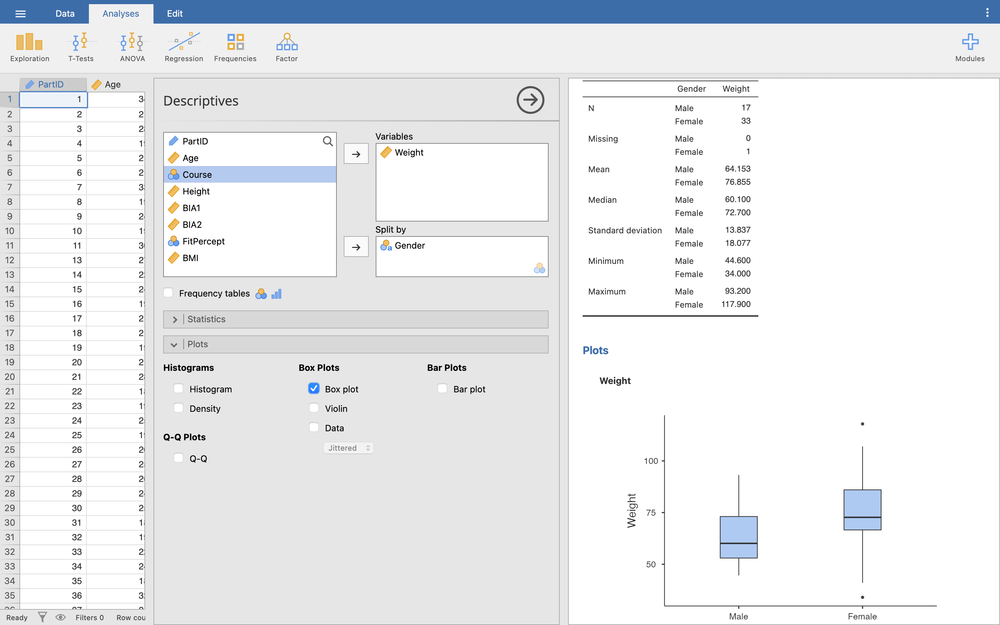

\wordtoc

## Setup

Open up the **Body Compsosition.omv** file from previous weeks and clear your Results viewer of any previous results, so we can start fresh. Make sure you've saved the additions we did in Week 1, with PartID 53.

::: Aside

We won't be going over every little detail for tasks like this that we've done in previous weeks - if you can't remember how to do anything, go back and review the previous worksheets.

:::

## Independent groups

If you have two groups that are **not** related - i.e. they are completely separate people, or independent measures - you can use the following tests to compare them:

- Independent measures *t*-test for parametric data
- Mann-Whitney U test for non-parametric data 

### Independent measures *t*-test

For this first test we are going to go back to the **Weight** and Height data. We have 50 participants in our data set, and you can see from gender we have type 1 (male) and type 2 (female). We are interested in these students to see: who is heavier, male or female?

At its very simplest, examining the mean and standard deviation will give us ‘an’ answer to this question. Click **Analyses**, then **Exploration**, then **Descriptives**. Move **Weight** into variables, and split by **Gender**. Go into the **Plots** option and turn on **Box plot** too.

::: Questions

Q1. What is the mean weight of males and females?

Q2. What is the standard deviation of males and females?

:::

It should be clear from the boxplot that the females are heavier than males, but notice that the spread of females is greater than males, so simply using the mean, or any other measure of central tendency does not give the full story.

::: Questions

Q3. Before we can run a parametric test, what are the 4 conditions we must satisfy?

Q4. Run a test for normality while in the Descriptives menu - what values do you get, and does this satisfy the appropriate parametric test?

:::

Assuming we have parametric data here, let's do the independent samples *t*-test. In **Analyses**, click **T-Tests**, then **Independent Samples T-Test**. Move **Weight** into the dependent variables box and **Gender** into the grouping variable selection box.

Under **Tests** under the variables selection boxes, make sure **Student's** is ticked.

::: Aside

The *t*-test is sometimes called Student's *t*-test, named after the person who invented it. Although his name wasn't actually Student - his real name was [William Sealy Gosset](https://www.encyclopedia.com/people/social-sciences-and-law/sociology-biographies/william-sealy-gosset), but he wasn't allowed to publish his work under his own name, so he used the pseudonym Student.

:::

Underneath **Tests** is the **Hypothesis** section. We don't have a prediction of which group might be heavier yet, so make sure **Group 1 ≠ Group 2** is ticked. This just means that we are testing is Group 1 (Male) is not equal to Group 2 (Female), but it doesn't matter which one is heavier than the other, only that they are different.

::: Aside

If we had a prediction that Males would be heavier than Females and **only** wanted to test for that, we would tick **Group 1 > Group 2**. This would not give us a significant result if they were the same weight, **or** if Females were heavier than Males.

:::

While we're here, under **Additional statistics** tick **Mean difference** and **Effect size** boxes, both with the **Confidence interval** box ticked (leave both at 95%), and **Descriptives**.

Under **Assumption checks** tick **Homogeneity test**.

Let's look at our Results. Starting with the **Group Statistics** table, you can see the same basic information that we found in the Descriptives from before (SD - standard deviation, SE - standard error of the mean).

Under the **Assumptions** heading, we can also see our **Levene's** test results for homogeneity of variance.

::: Questions

Q5. Does our data meet the assumption of homogeneity of variance?

:::

The **Independent Samples T-Test** table in our Results viewer shows us the outcome of our *t*-test. Reading from the top line, we are mostly interested in the *p* value. Here the *p* value is 0.015, so there is strong evidence to suggest that the difference in weight between male and female is > 0 kg. The mean difference shows that the average difference in weight between the groups in our sample is 12.7 kg.

::: Aside

Remember the difference between a **sample** (the data we have collected) and a **population** (the entire possible group of people everywhere we could have collected our data from). The 95% confidence interval for the mean shows that the difference in weight between the **populations** is somewhere between 2.6 and 22.7 kg. The smaller the confidence interval, the more confident we can be that our sample statistic - mean difference - truly represents the same statistic in the population our sample is drawn from.

:::

Finally, we can look at the effect size. We can calculate Pearson’s correlation coefficient (*r*) for *t*-tests, similar to correlation, but the more common reported effect size for *t*-tests is Cohen’s *d*, and this is what Jamovi reports. We can interpret the values for Cohen's *d* from the Results viewer based on the below table of commonly used criteria:

| Cohen's *d*     | Interpretation       |
| --------------- | -------------------- |
| *d* < 0.2       | Trivial / negligible |
| 0.2 < *d* < 0.5 | Small                |
| 0.5 < *d* < 0.8 | Moderate             |
| 0.8 > *d*       | Large                |

::: Aside

**Note:** Unlike *r*, Cohen’s *d* can go above 1 for a particularly large effect size.

:::

**Now you try**: Repeat the independent measures *t*-test for **Height** across gender using this data set.

::: Questions

Q6. What is the null and experimental hypothesis for this test?

Q7. Is this data parametric?

Q8. Which test should you run and why?

Q9. What is it about the layout of the data that suggests this test?

Q10. When you run the t-test, what is the result of Levene’s test for Equality of Variance and what does this mean?

Q11. What is the p value for the Independent Measures T-test and again what does this mean?

Q11. What is the effect size of this result?

Q12. How would you report these results in your essay / coursework / dissertation?

:::

### Mann-Whitney U test

##  Repeated measures groups

If your two groups that **are** related - i.e. repeated measure groups - you can use the following tests to compare them:

- Repeated measures *t*-test for parametric data
- Wilcoxon signed rank test for non-parametric data

### Repeated measures *t*-test

### Wilcoxon signed rank test

\newpage

## Answers to questions

::: Questions

Q1. The mean weight of males and females is 64.15 and 77.86 kg respectively.

Q2. The standard deviation of the weight of the male and female groups are 13.84 and 18.08 kg.

Q3. The four tests we must satisfy before running a parametric test are:

- Normal distribution
- High level data
- Random selection / allocation of participants (or independence of samples)
- Homogeneity of variance

Q4. From the Shapiro-Wilk test:

- Male p = 0.382
- Female p = 0.291

Both are not significant, so there is little evidence to suggest that the distribution deviates from normal.

Q5. Yes - the Levene's test shows *p* = 0.427. This is greater than 0.05, our criteria for significance, showing that these two groups do **not** have significantly different variances.

Q6. The null hypothesis is written as:

- H~0~: µ~A~ = µ~B~

The experimental hypothesis would be:

- H~0~: µ~A~ ≠ µ~B~

Where µ~A~ is the mean height of the population of group A, and µ~B~ is the mean height of the population of group B. The null hypothesis says that there is no significant difference between the mean heights of group A and group B. The experimental hypothesis says that there is a significant difference between the mean heights of group A and group B. Remember that this is for the **population**, not just the samples you are looking at.

Q7. Yes the data is parametric. It satisfies the four conditions:

 - High level data
 - Independence of measures
 - Yes to equality of variance (Levene *F* = 0.178, *p* = 0.675)
 - Shapiro-Wilk test of normality (Male *p* = 0.142, Female *p* = 0.522)  

Q8. As the data is parametric and we want to find the difference between two different groups, we should run an Independent Measures *t*-test.

Q9. In the Jamovi data file, one set of data is below the other, so every height belongs to a different participant. If each participant had 2 pieces of data to compare, e.g. pre and post, then we would run a repeated measures *t*-test.

Q10. When running the t-test, Levene’s test for Equality of Variance *p* = 0.675. This shows us that the variance from both groups are not significantly different from each other.

Q11. *p* = 0.002. This means there is strong evidence against the null hypothesis, i.e. there is strong evidence to suggest that the heights of the two groups are different. When examining the means, it is clear to see that the females are, on average, taller than the males.

Q12. Cohen's *d* = 0.98, so a large effect size.

Q13. On average, there was a significant difference between the height of males (*M* = 166.78) and females (*M* = 174.52). The difference was significant, *t*(49) = -3.305, *p* = 0.002, *d* = 0.982.

:::
