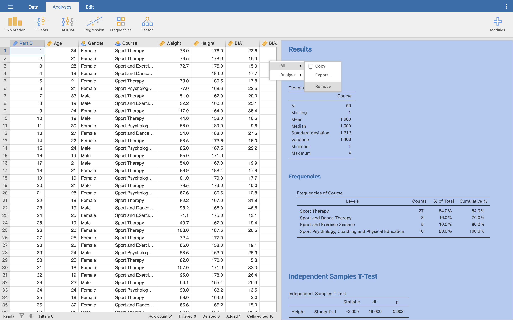
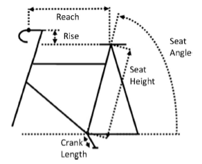
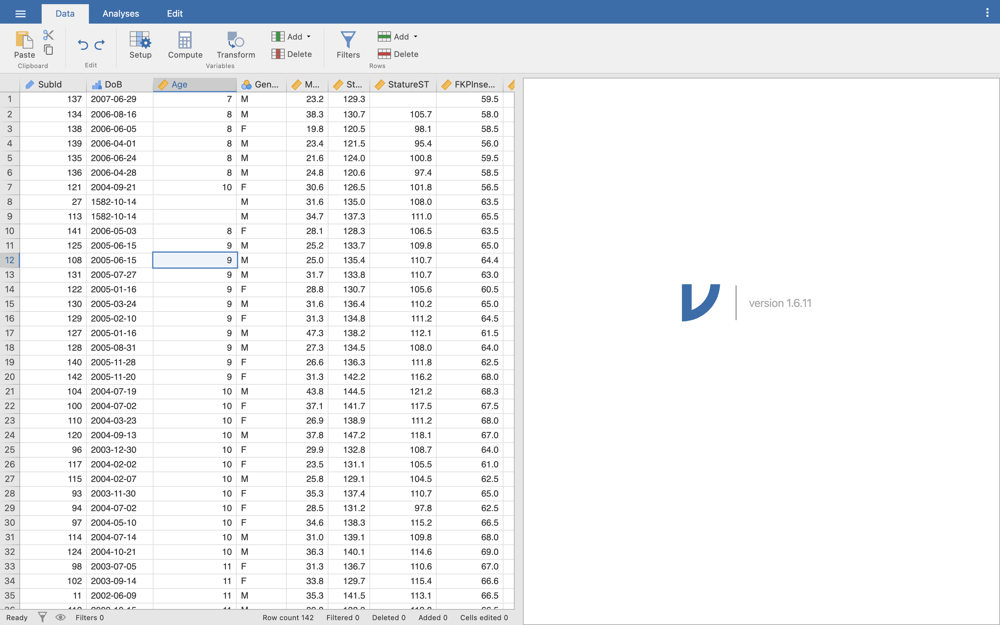
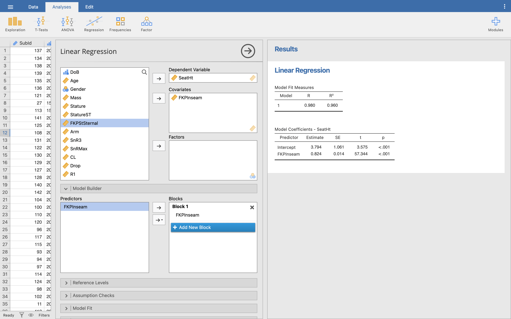
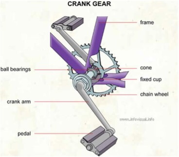
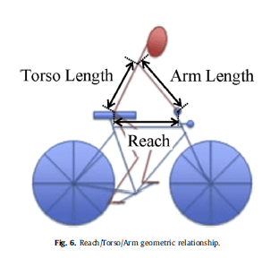
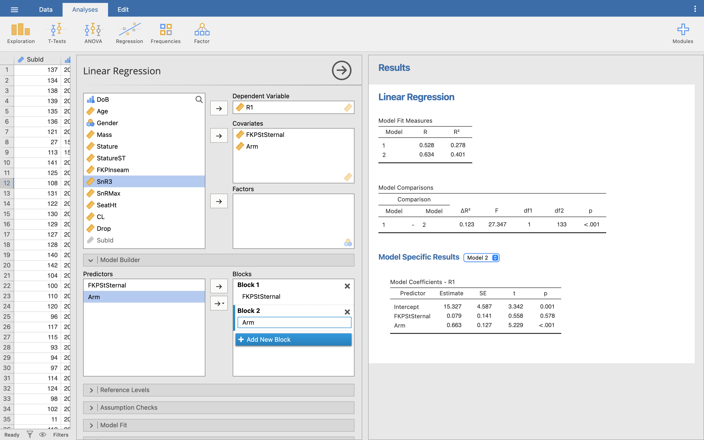

:::: {.wordonly}
At this level you will be expected to know about two ways of looking for relationships between your data. These are:

- Correlation
- Regression

::: {.Note custom-style="QuestionList"}
As you work through this worksheet, there will be **Learning Checks** in grey boxes like this that ask you questions about what has just been covered. You can fill the answers in under the questions themselves, or in a separate document or notepad, or even just in your own head - these questions are not submitted for assessment, they are just to help you fully learn how to use Jamovi. Answers to all the questions are provided at the end of this worksheet for you to check if you were correct.
:::
::::

## Setup

Let's continue working with our **Body Composition.omv** file from before. Open it up in Jamovi now. If you saved the file after we made all the changes in the last worksheet, it should open up with partID 53 entered, all the variables correctly setup and labelled, and the output from our previous tests in the Results viewer. Check all that now.

Before we do our new tests, let's clear the Results viewer so we can start from fresh. Right-click anywhere in the Results viewer, then choose **All**, then **Remove**. This should clear the Results viewer.



## Bivariate correlation

In our data set, you will remember we measured the body fat using two separate machines, **BIA1** and **BIA2**. We did this to check the machines were giving the same value.

::: {.Note custom-style="QuestionList"}
Q1. By using two separate machines are we testing for validity or reliability?


:::

Look at the BIA1 and BIA2 columns now. From visual inspection it does appear that the two numbers are similar – but how similar? In this section we are going to see how close each machine is to the other in reporting body fat percentage. We are going to examine this using a bivariate correlation (a correlation between two variables), remembering that this will only work for data with a linear relationship (this is an assumption we will make at this stage).

::: {.Warning custom-style="Aside"}
**Note**: Just because there may be strong correlation between two values, it does not mean that the two values are the same. It just says that for every unit increase in one variable there is similar unit increase in the other.  You cannot use this method alone to test for inter-machine (or inter-tester reliability). Use Intra-Class Correlations for this – see [Koo *et al*. (2016)](https://www.sciencedirect.com/science/article/abs/pii/S1556370716000158), *A guideline of selecting and reporting intraclass correlation coefficients for reliability research* for details.
:::

Let's run the correlation analysis. Click on **Analyses**, then the **Regression** icon, then choose **Correlation Matrix**.

You'll see the Correlation menu, much the same as we did for Descriptives and T-Tests last time. Move the **BIA1** and **BIA2** variables into the variables selection.

In the options underneath, make sure **Pearson** is ticked, then **Report Significance**, **Flag significant correlations**, and **N**. You'll see our correlation matrix update in the Results viewer.


The correlation matrix shows a row for each variable, and a column for each variable, so for 2 variables you will have 4 correlations (BIA1/BIA1, BIA1/BIA2, BIA2/BIA1 and BIA2/BIA2). Jamovi only fills in the results for **unique** combinations of rows and columns - so it doesn't show anything for the top right corner as it's exactly the same as the bottom left corner.

::: {.Note custom-style="QuestionList"}
Q2. Why does Jamovi not show how a variable correlates with itself?


Q3. If it did show this information, what would you expect the Pearson's *r* result to be?


:::

Jamovi also doesn't show how a variable correlates with itself, so here, the BIA1/BIA1 and BIA2/BIA2 combinations are also left blank. This makes it easier to see just the information we are after - the correlation between BIA1 and BIA2.

::: {.Note custom-style="QuestionList"}
Q4. What is the Pearson correlation coefficient between BIA1 and BIA2?


Q5. What does the ** mean?


Q6. What would a single star (*) mean instead?


Q7. For a correlation what does the significance value tell us?


:::

So, this correlation could be written as:

Body fat recorded on BIA1 was significantly correlated with body fat from BIA2, *r*(46) = 0.990, *p* < 0 .001.

::: {.Warning custom-style="Aside"}
**Note:** pay attention to how you format your findings when typing them out like this - notice the *italics* on both *r* and *p*, and the single space either side of the less than (<), and equals (=) signs.)
:::

**Now you try:** Using the same data set, perform a bivariate correlation between weight and height (no groupings).

::: {.Note custom-style="QuestionList"}
Q8. What is the Pearson coefficient? Using the Fitz-Gibbon and Morris categories (from your lecture notes) how strong is this relationship? 


Q9. What is the 2-tailed significance value, and what does this mean?


Q10. Using the Pearson correlation coefficient *r*, what is the *R^2^* (coefficient of determination) value for the relationship between Weight and Height? If we assume that the Height is the IV and Weight is the DV, what does this new value mean?


:::

## Regression

### Linear regression

We have looked at how to measure a relationship between two variables (a correlation), but we can take this further and predict one variable from another.

In this example, we are going to break away from our Body Fat/BMI data, and look at some *real* biomechanics research data ^[Grainger, K., Dodson, Z. and Korff, T. (2017) ‘Predicting bicycle setup for children based on anthropometrics and comfort’, *Applied ergonomics*, 59, pp. 449-459]. In this study, a large number of children (*n* = 142) were measured, to see if two properties of a bike fit could be predicted: seat height and reach.



In Jamovi, open the **BikeFit.omv** data file.



Our first question is to see if we can predict the seat height (**SeatHt** variable) from inside leg length (**FKPInseam** variable, named because we used a piece of equipment called the FitKitPro Inseam Measurement Device).

::: {.Note custom-style="QuestionList"}
Q11. In this example, what is the independent variable and what is the dependent variable?


Q12. Before going into the regression analysis, perform a Pearson bivariate correlation between the two variables. What is the Pearson correlation coefficient, and based on Fitz-Gibbon and Morris what is the strength of the relationship? 


:::

For regression modelling, click **Analyses**, then **Regression**, then **Linear Regression**. The Regression menu will pop up in the middle, and an empty table will appear in the Results viewer. 

Move **SeatHt** into the Dependent variable selection box, and move **FKPInseam** into the Covariates selection box.

::: {.Warning custom-style="Aside"}
**Note:** Regression in Jamovi is in two stages. Covariates just means all the variables that we are interested in, besides our dependent variable, but *not necessarily* all our covariates will become our independent variables.

Once we've picked all our covariates, we then tell Jamovi which of those to take a step further and actually use as independent variables for our regression. For now, we'll just always make our covariates and independent variables the same, to keep things simple.
:::

Click the **Model Builder** option underneath our variable selection area. You should see the same variables we selected as Covariates above - in this case, **FKPInseam**. Move this over to the area titled **Block 1**.



::: {.Warning custom-style="Aside"}
**Note:** You might find Jamovi has automatically moved your covariates into blocks in the model builder for you. If so, great!
:::

Some regression results should finally pop up in the Results viewer. Let's look at those two tables:

**Model Fit Measures:** These tell you how 'good' your model is. The values you are interested in here are the Pearson correlation coefficient (R), and the coefficient of determination (R^2^). You already saw the correlation coefficient earlier. Recall that R^2^ is the square of the R value, so (0.980)^2^ = 0.960.

**Model Coefficients - SeatHt:** This section tells us the actual linear regression results for our variable SeatHt, and helps us build the prediction formula to predict the variable from new data.

We have already seen in the lecture that our prediction model is of the format:

Dependent Variable = b~0~ + b~1~ (Independent Variable)

In Jamovi, the b (or beta) values are in the **Estimate** column. So, from the table, we can read:

- b~0~ (intercept/constant) = 3.794
- b~1~ (FKPInseam/gradient) = 0.824

So, our regression model formula becomes:

Seat Height = 3.794 + 0.824 * Inseam (in cm)

Just substitute your inseam measurement (in centimetres) into the formula to get a prediction of seat height.

::: {.Note custom-style="QuestionList"}
Q13. If your participant has an inseam of 70cm, what is their predicted seat height (to 1 decimal place)?


Q14. What is the significance for the constant and the one predictor variable? What do these values mean?


:::

**Now you try:** The crank arm length (Crank Length - CL) is the distance between the bottom bracket and the pedal, effectively what constrains the pedal in its circle. 



Research has shown that this is related to the leg length (Fit Kit Pro Inseam – FKPInseam). So now, produce a model to predict **crank length** from **inseam** length.

::: {.Note custom-style="QuestionList"}
Q15. What is the Independent Variable?


Q16. What is the Dependent Variable?


Q17. What is the Pearson Moment Correlation Coefficient between these two variables and what does this mean?


Q18. What is the R^2^ value, and what does this mean in terms of the ‘model’ of crank length?


Q19. What is the model equation for crank length?


Q20. What is the significance of the constant and single coefficient, and what does this mean?


:::

### Multiple linear regression

Multiple linear regression is very similar to simple linear regression, except we now have multiple predictor (independent) variables.

We will use the same **BikeFit.sav** data, but this time we are going to predict the reach (**R1**) value, i.e. the horizontal distance between the saddle and the handlebar. Based on simple geometry, it looks like this value will be based on a combination of torso length (**FKPStSternal**) and arm length (**Arm**).



The model we expect to find is:

Reach~i~ = b~0~ + b~1~(Torso length) + b~2~(Arm Length)

::: {.Note custom-style="QuestionList"}
Q21. From the lecture slides on regression modelling, what and before we can run the model, how big should our sample be when we have two predictors? 


:::

First, clear your Results viewer. Then, open the **Linear Regression** menu the same way as before.

Make **R1** the Dependent variable, then move both the **FKPStSternal** and **Arm** variables into the Covariates selection box. Click on the Model Builder option.

Now, let's actually make two models, so we can compare how each performs. Move **FKPStSternal** into Block 1 in the Model Builder, same as before, then click **Add New Block** and move **Arm** into Block 2. This creates two models - Model 1 contains just FKPStSternal as an independent variable, while Model 2 contains both FKPStSternal and Arm as independent variables.



::: {.Warning custom-style="Aside"}
To see each model's coefficients, click the dropdown menu next to the 'Model Specific Results' heading in the Results viewer, and choose either Model 1 or Model 2.
:::

We can now use the Model Fit Measures table in the Results viewer to see how our two models perform.

::: {.Note custom-style="QuestionList"}
Q22. How strong is the Pearson correlation coefficient for each model?


Q23. What is the R^2^ value for each model and what does it mean?


:::

Let's focus on the R^2^ column - remember that R^2^ shows how much variance our model explains in our dependent variable. Model 1 explains around 27% of the variance, while Model 2 explains around 40%. Model 2 is explaining more variance, so we can think of it as a 'better' model - so let's use it to build our prediction formula. 

Make sure the Model Specific Results section is showing Model 2 in the Results viewer. This can be read in exactly the same way as the simple linear regression:

Reach = 15.327 + 0.079 * (Fit Kit Pro Sternal) + 0.663 * (Whole Arm).

::: {.Note custom-style="QuestionList"}
Q24. For a child with a sternal height of 42 cm and an arm length of 51 cm what would be the expected reach? (Remember that all values should be entered in centimetres.)


:::

The significance value again can be read as a measure of whether the predictor is making a significant contribution to the model. The smaller the value of *p*, the greater contribution to the model. In the Reach model, it is clear that arm length makes a significant contribution (*p* < 0.001), but the torso height (Fit Kit Pro Sternal) is not significant (*p* = 0.578).

::: {.Note custom-style="QuestionList"}
Q25. Run the linear regression again, but with just the arm length. What new R^2^ value does this give?


:::

**Now You Try:** We have seen there is a good model of reach when using torso and arm length, but is drop as easy to predict? Create a multiple linear regression model using arm length (**Arm**), sternal height (**FKPStSternal**) and maximum sit and reach values (**SnRMax**) to predict drop (**Drop**).

::: {.Note custom-style="QuestionList"}
Q26. What is the dependent variable?


Q27. What are the independent variables?


Q28. Run the linear regression.  What is the R value, and based on Fitzgibbon and Morris, what is the strength of the correlation?


Q29. What is the coefficient of determination for this model and what does this value suggest?


Q30. 	Are any of the 3 variables significant in the model, and if so what is the *p* value for it/them?


Q31. Rerun the model, but this time without any independent variables that are not significant in the previous model. What is the R2 of this model?


Q32. 	Discuss the significance and strength of the model.


Q33. 	Finally, what is the equation of this model?


:::

:::: {.wordonly}
```{=openxml}
<w:p>
  <w:r>
    <w:br w:type="page"/>
  </w:r>
</w:p>
```
::::

## Answers to questions

::: {.Note custom-style="QuestionList"}
Q1. Here we are examining inter-machine reliability, checking that the two machines give the same value.  We cannot say that the value is ‘true’ (valid), only that the two machines are reporting the same value (reliable).

Q2. A variable will *always* perfectly correlate with itself - since we know this will always be the case, there is no point displaying the extra information.

Q3. A perfect correlation would mean *r* = 1.

Q4. The Pearson Moment Correlation Coefficient between BIA1 and BIA2, *r* = 0.990.

Q5. The double star indicates that the result is significant at the 1% level (p < 0.01). You can read this in the caption underneath the results table.

Q6. A single star would indicate significance at the 5% level (p < 0.05).

Q7. The significance tells us that the probability of getting a correlation coefficient this strong in a sample of 48 people if the null hypothesis were true (i.e no relationship between the two variables) is very low (almost zero). Hence we can be confident that there is a genuine relationship between the readings on BIA1 and BIA2.

Q8. The Pearson Moment Correlation Coefficient, *r* = 0.382. From Fitz-Gibbon and Morris, this would be classified as a weak correlation (0.2 - 0.4).

Q9. The two-tailed significance value is *p* = 0.006. Similar to the BIA results, it tells us that the probability of getting a correlation coefficient of this value in a sample of 50 if the null hypothesis were true (i.e. no relationship between the two variables) is very low. Hence we can be confident that there is a relationship between the two variables, albeit a weak relationship.

Q10. If the correlation value between weight and height is *r* = 0.384, then the coefficient of determination is *R^2^* = 0.146. This value tells us how much of the variability in weight is accounted for by height. Alternatively, we could say that weight shares 14.6% of the variability in height, or rather height only accounts for 14.6% of the variability in weight, leaving the remaining 85.4% of the variability in weight down to other factors.

Q11. The independent variable is the inseam measure (FKPInseam) and the dependent variable is seat height (SeatHt) – seat height depends on inseam.

Q12. The Pearson Moment Correlation Coefficient here is *r* = 0.980, this is a very strong positive correlation.

Q13. SeatHeight = 3.794 + 0.824 * Inseam, so if inseam = 70 cm, then SeatHeight = 3.794 + (0.824 * 70) = 61.5 cm. The seat height from this model for an inseam of 70 cm is 61.5 cm.

Q14. Both show a significance, *p* < .001, i.e. they are both highly significant in the model. In other words, if we say that the null hypotheses are that there is no relationship between the constant and seat height, and inseam and seat height, then we are confident that we can reject these null hypotheses. There is strong evidence to suggest that both the constant and the inseam are strong predictors in this model.

Q15. In this model, the independent variable must be the Inseam measure (this is the value that the dependent variable depends on).

Q16. In this model the dependent variable is the crank length (as the crank length depends on the independent variable in the model).

Q17. The Pearson Moment Correlation Coefficient is 0.984. From Fitzgibbon and Morris, this is classified as a very strong relationship.

Q18. The R^2^ value can be calculated from (0.9842)^2^ = 0.969. This means that nearly 97% of the model of crank length is predicted through the inseam/leg length, only 3% of the model is predicted from other factors.

Q19. The model equation for crank length is given by: Crank Length = 5.937 + (1.908 x Inseam), where crank length is given in mm, and inseam length is given in cm.

Q20. Constant *p* = .006, inseam *p* < .005. These are both significant and should appear in the model.

Q21. This is a really ‘it depends’ answer. Bare minimum is 5x the number of predictors (so 10), better would be 10:1 (so 20). Green’s (1991) suggestion would be  50 + 8k (where k = number of predictors). This would suggest 66 cases at a minimum.

Q22. Model 1 R = 0.528, Model 2 R = 0.634. From FitzGibbon and Morris, a Pearson Moment Correlation Coefficient of 0.634 would suggest a strong positive correlation (0.6 - 0.8 = strong).

Q23. Model 1 R^2^ = 0.278, Model 2 R^2^ = 0.401. This says that approximately 28% of Reach in Model 1 and 40% of Reach in Model 2 can be predicted while the remaining 72% or 60% of the model comes from other factors.

Q24. Using the given model, and the sternal height of 42 cm, and arm length of 51 cm: Reach = 15.327 + 0.079 * 42 + 0.663 * 51 = 53.4cm. Our model would suggest a reach of 53.4 cm for the given sternal height and arm length.

Q25. Using just the whole arm length in the model, reduces our R^2^ to 0.400. While this appears to be ‘worse’, the difference is negligible and also removes the non-significant torso length from the model.

Q26. The dependent variable is Drop (Handlebar drop)

Q25. The independent variables are FKPStSternal, Arm and SnRMax.

Q26. The R value is 0.378, this is a weak correlation.

Q27. The coefficient of determination is the R^2^ value, which is just 0.143. This means that the variables input into the model (torso length, arm length and maximum sit and reach score) reflect just 14% of the model of drop, over 80% of the model is predicted through something else.

Q28. Only the arm length is significant in the model with *p* = 0.025, the other variables do not significantly add to the model (FKPStSternal = 0.504, SnRMax = 0.756). Note that the constant value (33.270) is significant in the model *p* < 0.001.

Q29. The R^2^ is 0.139.

Q30. The model is significant, i.e. if we were to run the experiment again, it is highly likely we would get the same result again, with *p* < 0.001. The model however is very weak, with an R^2^ of only 0.139, the variables given to the model do not predict well the handlebar drop.

Q31. Drop = 32.459 – 0.408 x arm length.
:::